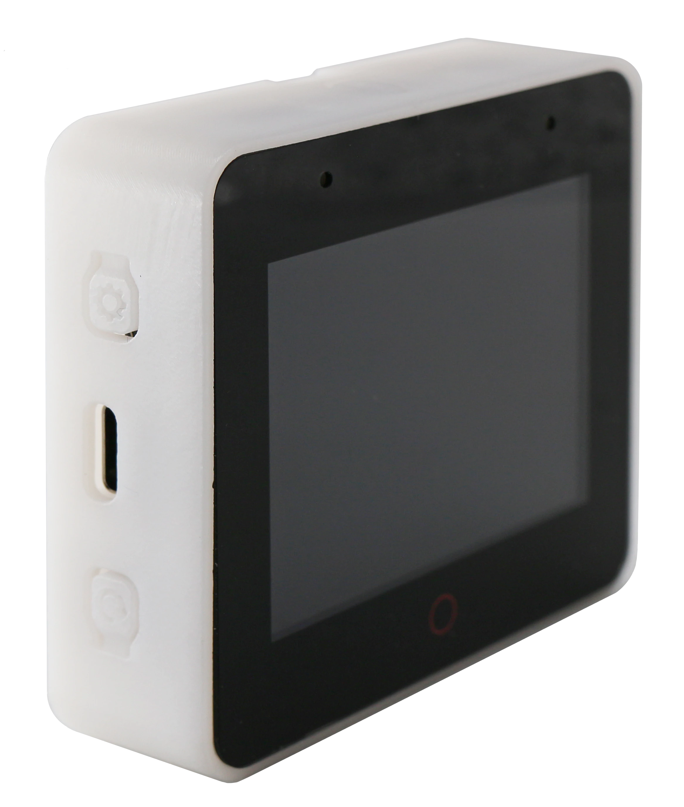

[](https://github.com/pre-commit/pre-commit)

# ESP-BSP: Espressif's Board Support Packages
Board support packages for development boards using Espressif's SoCs, written in C.

## Supported boards
| Board name | SoC | Features | Photo |
|---|---|---|---|
| [ESP-WROVER-KIT](esp_wrover_kit) | ESP32 | LCD display, uSD card slot |  |
| [ESP-BOX](esp-box) | ESP32-S3 | LCD display with touch, audio codec + power amplifier,<br>accelerometer and gyroscope |  |
| [ESP32-Azure IoT Kit](esp32_azure_iot_kit) | ESP32 | OLED display, uSD card slot, accelerometer,<br>magnetometer, humidity, pressure, light<br>and temperature sensors |  |
| [ESP32-S2-Kaluga Kit](esp32_s2_kaluga_kit) | ESP32-S2 | LCD display, audio codec + power amplifier,<br>smart LED and camera |   |
| [ESP32-S3-USB-OTG](esp32_s3_usb_otg) | ESP32-S3 | LCD display, uSD card slot, USB-OTG |   |
| [ESP32-S3-EYE](esp32_s3_eye) | ESP32-S3 | LCD display, camera, uSD card slot, microphone and accelerometer |  |

## LCD and TOUCH drivers

The BSP repository includes lot of LCD and Touch driver components. The list of available and planned LCDs is [here](LCD.md).

## How to use

### Examples

Best way to start with ESP-BSP is trying one of the [examples](examples) on your board. Every example contains `README.md` with list of supported boards. Here is a examples' summary:

| Example | Supported boards |
|---|---|
| [display](examples/display) | WROVER-KIT |
| [display_audio](examples/display_audio) | Kaluga-kit |
| [display_camera](examples/display_camera) | Kaluga-kit |
| [display_audio_photo](examples/display_audio_photo) | ESP-BOX |
| [display_rotation](examples/display_rotation) | ESP-BOX |
| [mqtt_example](examples/mqtt_example) | Azure-IoT-kit |
| [rainmaker_example](examples/rainmaker_example) | Azure-IoT-kit |
| [sensors_example](examples/sensors_example) | Azure-IoT-kit |

### In custom project 
Packages from this repository are uploaded to [Espressif's component service](https://components.espressif.com/).
You can add them to your project via `idf.py add-dependancy`, e.g. 
```
    idf.py add-dependency esp_wrover_kit==1.0.0
```

Alternatively, you can create `idf_component.yml` file manually, such as in [this example](examples/display/main/idf_component.yml).

## Migration to ESP-IDF version 5.0
esp-idf 5.0 brings a lot of new features, but, as the bump in major version suggests, also lot of breaking changes.

ESP-BSP is kept up-to-date with latest esp-idf version, but some breaking changes in ESP-BSP API are inevitable.
Usually, BSPs compatible with IDF v5.0 are version 2. If you want to use BSP with IDF v4.4 you can still use version 1 of the particular BSP.

More information can be found in [official migration guide](https://docs.espressif.com/projects/esp-idf/en/latest/esp32/migration-guides/release-5.x/index.html).

## Additional information
More information about idf-component-manager can be found in [Espressif API guide](https://docs.espressif.com/projects/esp-idf/en/latest/esp32/api-guides/tools/idf-component-manager.html)
or [PyPi registry](https://pypi.org/project/idf-component-manager/).
