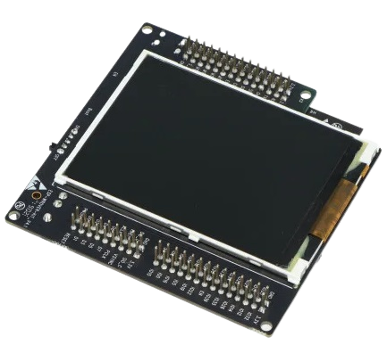
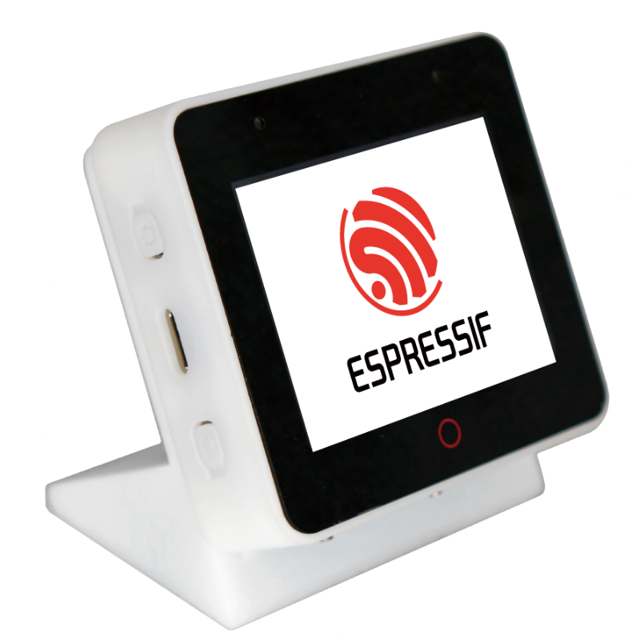
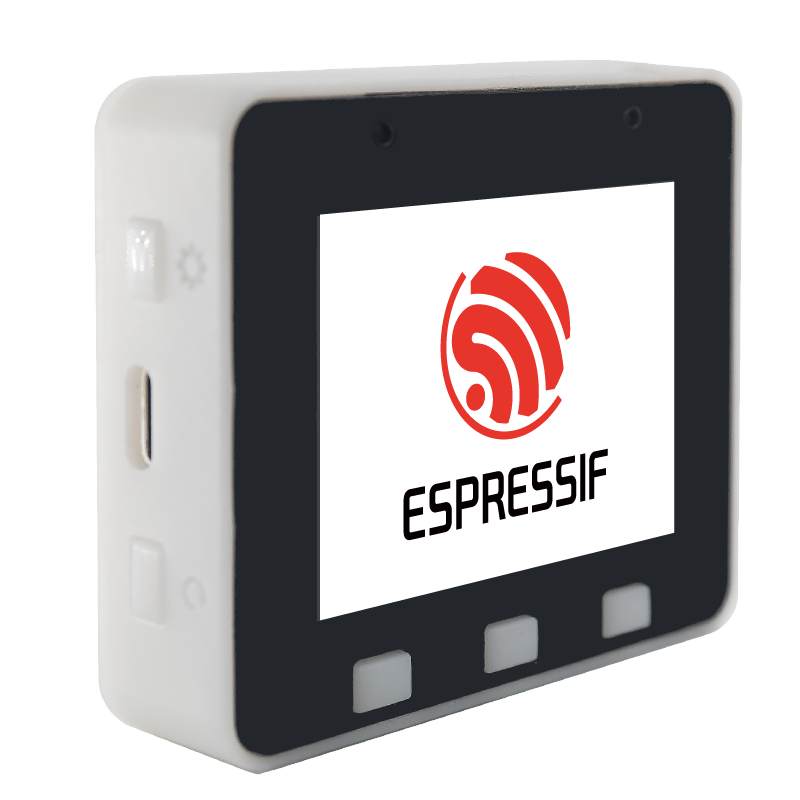
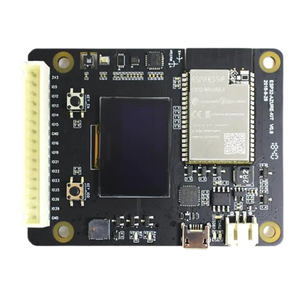
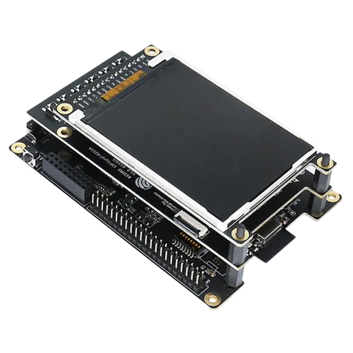
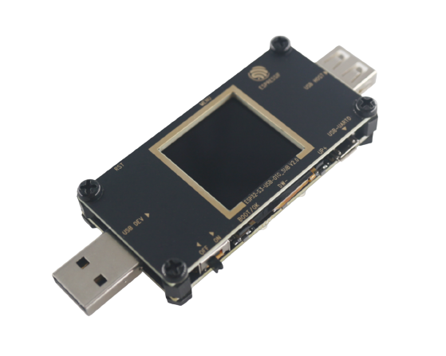
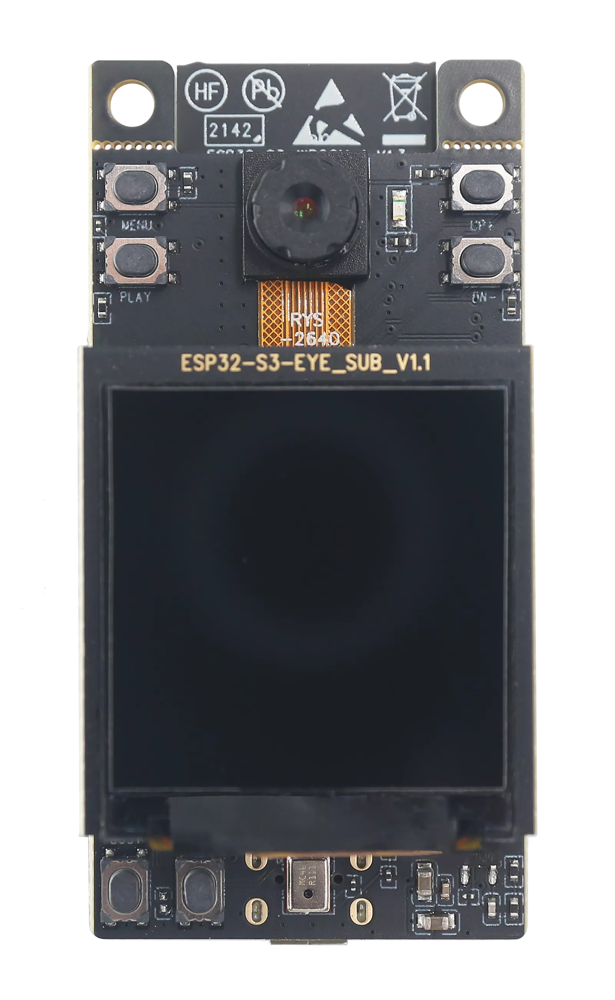
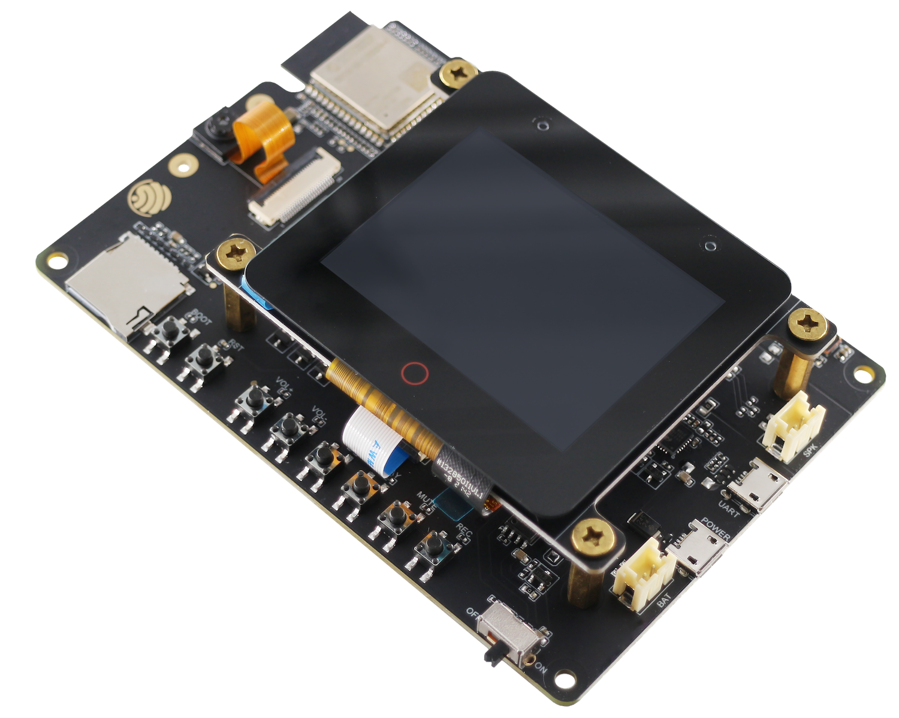
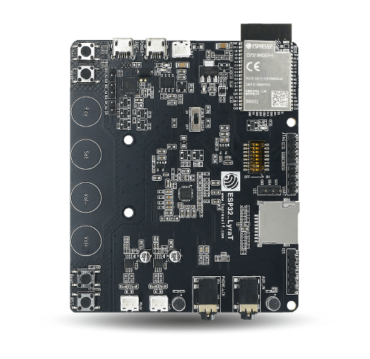
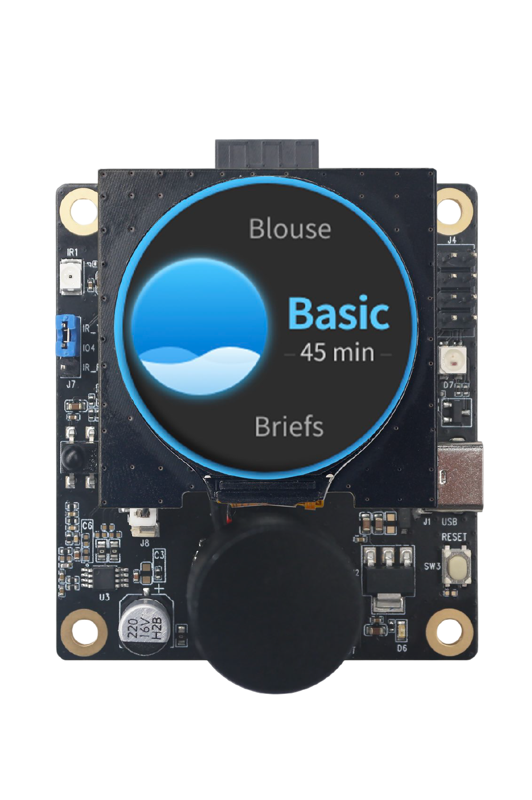

[](https://github.com/pre-commit/pre-commit)

# ESP-BSP: Espressif's Board Support Packages
Board support packages for development boards using Espressif's SoCs, written in C.

## Supported boards
| Board name | SoC | Features | Photo |
|---|---|---|---|
| [ESP-WROVER-KIT](bsp/esp_wrover_kit) | ESP32 | LCD display, uSD card slot |  |
| [ESP-BOX](bsp/esp-box) | ESP32-S3 | LCD display with touch, audio codec + power amplifier,<br>accelerometer and gyroscope |  |
| [ESP-BOX-Lite](bsp/esp-box-lite) | ESP32-S3 | LCD display, audio codec + power amplifier |  |
| [ESP32-Azure IoT Kit](bsp/esp32_azure_iot_kit) | ESP32 | OLED display, uSD card slot, accelerometer,<br>magnetometer, humidity, pressure, light<br>and temperature sensors |  |
| [ESP32-S2-Kaluga Kit](bsp/esp32_s2_kaluga_kit) | ESP32-S2 | LCD display, audio codec + power amplifier,<br>smart LED and camera |   |
| [ESP32-S3-USB-OTG](bsp/esp32_s3_usb_otg) | ESP32-S3 | LCD display, uSD card slot, USB-OTG |   |
| [ESP32-S3-EYE](bsp/esp32_s3_eye) | ESP32-S3 | LCD display, camera, uSD card slot, microphone and accelerometer |  |
| [ESP32-S3-LCD-EV-Board](bsp/esp32_s3_lcd_ev_board) | ESP32-S3 | LCD display with touch, audio codec + power amplifier |  |
| [ESP32-S3-LCD-EV-Board-2](bsp/esp32_s3_lcd_ev_board) | ESP32-S3 | LCD display with touch, audio codec + power amplifier |  |
| [ESP32-S3-Korvo-2](bsp/esp32_s3_korvo_2) | ESP32-S3 | LCD display, camera, uSD card slot, microphone, audio codec + power amplifier |  |
| [ESP32-LyraT](bsp/esp32_lyrat) | ESP32 | uSD card slot, microphone, audio codec + power amplifier |  |
| [ESP32-C3-LCDKit](bsp/esp32_c3_lcdkit) | ESP32-C3 | LCD display with encoder, IR, PDM audio|  |
| [ESP-BOX-3](bsp/esp-box-3) | ESP32-S3 | LCD display with touch, audio codec + power amplifier,<br>accelerometer and gyroscope |  |
| [ESP32-S3-KORVO-1](bsp/esp32_s3_korvo_1) | ESP32-S3-KORVO-1 | uSD card slot, microphone, audio codec + power amplifier, RGB led strip |  |
## LCD displays and TOUCH

| [LVGL port](components/esp_lvgl_port) | [LCD drivers](LCD.md) |
| :---: | :---: |

The BSP repository includes a lot of LCD and Touch driver components. The list of available and planned LCDs is [here](LCD.md).

We offer seemless integration of LVGL graphical library into esp-idf applications in [LVGL port](components/esp_lvgl_port) component.

Moreover, LVGL port includes recommendations and tips for increasing graphical performance.

## How to use

### Examples

Best way to start with ESP-BSP is trying one of the [examples](examples) on your board. Every example contains `README.md` with a list of supported boards. Here is the summary of the available examples:

| Example | Supported boards | Try with ESP Launchpad |
|---|---|---|
| [audio](examples/audio) | ESP32-S3-Korvo-2 | [Flash audio](https://espressif.github.io/esp-launchpad/?flashConfigURL=https://espressif.github.io/esp-bsp/config.toml&app=audio) |
| [display](examples/display) | WROVER-KIT | [Flash display](https://espressif.github.io/esp-launchpad/?flashConfigURL=https://espressif.github.io/esp-bsp/config.toml&app=display) |
| [display_camera](examples/display_camera) | Kaluga-kit | [Flash display_camera](https://espressif.github.io/esp-launchpad/?flashConfigURL=https://espressif.github.io/esp-bsp/config.toml&app=display_camera) |
| [display_audio_photo](examples/display_audio_photo) | ESP-BOX | [Flash display_audio_photo](https://espressif.github.io/esp-launchpad/?flashConfigURL=https://espressif.github.io/esp-bsp/config.toml&app=display_audio_photo) |
| [display_rotation](examples/display_rotation) | ESP-BOX | [Flash display_rotation](https://espressif.github.io/esp-launchpad/?flashConfigURL=https://espressif.github.io/esp-bsp/config.toml&app=display_rotation) |
| [display_lvgl_demos](examples/display_lvgl_demos) | ESP32-S3-LCD-EV-Board | [Flash display_lvgl_demos](https://espressif.github.io/esp-launchpad/?flashConfigURL=https://espressif.github.io/esp-bsp/config.toml&app=display_lvgl_demos) |
| [display_sensors](examples/display_sensors) | Azure-IoT-kit | [Flash display_sensors](https://espressif.github.io/esp-launchpad/?flashConfigURL=https://espressif.github.io/esp-bsp/config.toml&app=display_sensors) |
| [mqtt_example](examples/mqtt_example) | Azure-IoT-kit | - |

### BSP headers
Each BSP provides its header file in 'bsp' subfolder, so it can be included as follows: `#include "bsp/name-of-the-bsp.h"`.
For you convenience, each BSP also provides a wrapper header, which has the same name for all BSPs: `#include "bsp/esp-bsp.h"`.

BSPs that contain LCD screen or touchscreen also provide `bsp/display.h` and `bsp/touch.h`. These files provide functions for LCD or touchscreen initialization without LVGL graphics library, which is used by default.

> **_NOTE:_** There can be only one BSP in a single esp-idf project.

### In a custom project
Packages from this repository are uploaded to the [IDF component registry](https://components.espressif.com/).
You can add them to your project via `idf.py add-dependency`, e.g.
```
    idf.py add-dependency esp_wrover_kit==1.0.0
```

Alternatively, you can create `idf_component.yml` file manually, such as in [this example](examples/display/main/idf_component.yml).

### Recommendation for custom projects

When you want to use a BSP in a real project, it is highly recommended to disable configuration option `CONFIG_BSP_ERROR_CHECK` in menuconfig. You should check all returned error codes from all BSP functions you call. Otherwise, if the option `CONFIG_BSP_ERROR_CHECK` is enabled, any error encountered in a BSP will abort the program.

## Migration to ESP-IDF v5.0
ESP-IDF v5.0 brings a lot of new features, but, as the bump in major version suggests, also a lot of breaking changes.

ESP-BSP is kept up-to-date with the latest ESP-IDF version, but some breaking changes in ESP-BSP API are inevitable.
Usually, BSPs compatible with IDF v5.0 are version 2. If you want to use BSP with IDF v4.4 you can still use version 1 of the particular BSP.
If you are interested in BSP examples for IDF v4.4, you can git checkout tag `examples_v4.4`.

More information about ESP-IDF breaking changes can be found in the [official migration guide](https://docs.espressif.com/projects/esp-idf/en/latest/esp32/migration-guides/release-5.x/index.html).

### Compiling project for multiple BSPs

> :warning: **Experimental feature**: This feature is under development!

A single project can be run on multiple different development boards, if the boards contain the features required by the project (such as audio, display, camera...).
For this purpose, `idf.py` is extended by [examples/bsp_ext.py](examples/bsp_ext.py) which allows you to build an example for your specific BSP. Example command for [display](examples/display) e.g.:
```
idf.py -D SDKCONFIG_DEFAULTS=sdkconfig.bsp.esp_wrover_kit build
```

In case you want to build locally for multiple boards at the same time, it is useful to have separate build directories for each BSP configuration.
In order to achieve this, you can extend the above command like this:
```
idf.py -B build/wrover_kit -D SDKCONFIG_DEFAULTS=sdkconfig.bsp.esp_wrover_kit build
```
> Note: This feature is not yet integrated to idf.py by default. If you want to use it, you must set your environmental variable `IDF_EXTRA_ACTIONS_PATH` to path to `esp-bsp/examples/bsp_ext.py`.

## Additional information
More information about idf-component-manager can be found in [Espressif API guide](https://docs.espressif.com/projects/esp-idf/en/latest/esp32/api-guides/tools/idf-component-manager.html)
or [PyPi registry](https://pypi.org/project/idf-component-manager/).

You can find more information about idf.py extensions [here](https://github.com/espressif/esp-idf/blob/master/tools/idf_py_actions/README.md).

## Contributing to ESP-BSP

Please check [CONTRIBUTING.md](CONTRIBUTING.md) if you'd like to contribute to ESP-BSP.

## Copyrights and License

All original source code in this repository is Copyright (c) Espressif Systems (Shanghai) Co. Ltd., and is licensed under the Apache 2.0 license.
