[](https://github.com/pre-commit/pre-commit)


# ESP-BSP: Espressif's Board Support Packages

| [HOW TO USE](docu/how_to_use.md) | [BOARDS](#supported-boards) | [EXAMPLES](#examples) | [CONTRIBUTING](docu/CONTRIBUTING.md) | [LVGL port](components/esp_lvgl_port) | [LCD drivers](docu/LCD.md) | [Releases](https://espressif.github.io/esp-bsp/release_checker.html) |
| :---------------------------------------: | :-------------------------: | :-------------------: | :--------------: | :-----------------------------------: | :------------------------: | :------------------------: |

This repository provides **Board Support Packages (BSPs)** for various Espressif and M5Stack development boards. Written in **C**, each BSP offers a **unified and consistent API** to simplify the initialization and use of common onboard peripherals such as **displays, touch panels, audio codecs, SD cards, and selected sensors.** The goal is to streamline development and reduce hardware-specific boilerplate, enabling faster prototyping and cleaner application code.

## Main Purpose of BSP

1. **Simplify development** on Espressif and M5Stack boards by providing ready-to-use peripheral initialization.
2. **Enable quick project startup** on supported development boards, with an easy path to **migrate to custom hardware**.
3. **Facilitate cross-board development** by offering a **common API**, making it easier to build and maintain projects for multiple boards.

## Supported IDF versions

The following table shows the compatibility of this BSP with different ESP-IDF versions:

| 4.x | 5.0 | 5.1 |         5.2        |         5.3        |         5.4        |         5.5        |         6.0        |
| :-: | :-: | :-: | :----------------: | :----------------: | :----------------: | :----------------: | :----------------: |
| :x: | :x: | :x: | :heavy_check_mark: | :heavy_check_mark: | :heavy_check_mark: | :heavy_check_mark: | :heavy_check_mark: |

## Supported Boards
<!-- START_SUPPORTED_BOARDS -->

| Board name | SoC | Supported Features | Photo |
|:----------:|:---:|:-------------------|:-----:|
| [ESP-BOX-3](bsp/esp-box-3) | esp32s3 | :musical_note: Audio <br/>:microphone: Audio Microphone  (es7210)<br/>:speaker: Audio Speaker  (es8311)<br/>:radio_button: Button <br/>:pager: LCD Display  (st7789, ili9341)<br/>:video_game: IMU <br/>:floppy_disk: uSD Card <br/>:point_up: Display Touch  (tt21100, gt911)<br/> | 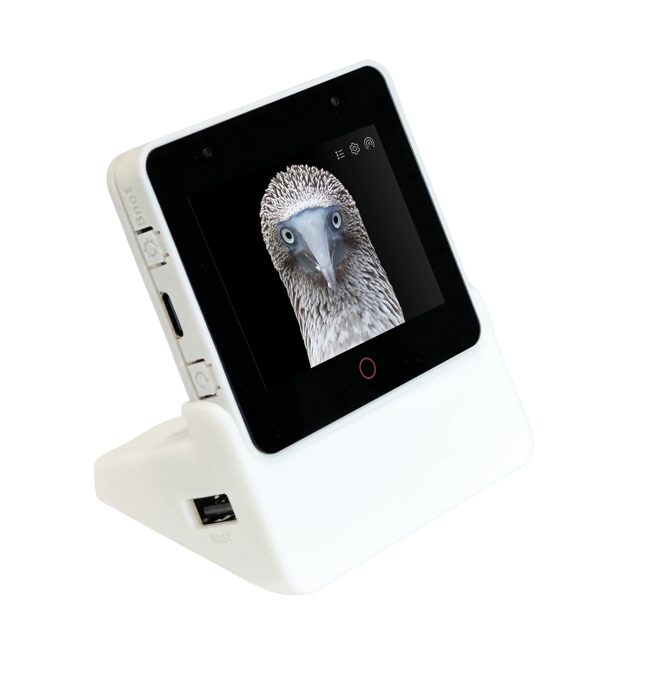 |
| [ESP32-C3-LCDKit](bsp/esp32_c3_lcdkit) | esp32c3 | :musical_note: Audio <br/>:speaker: Audio Speaker <br/>:pager: LCD Display  (gc9a01)<br/>:white_circle: Knob <br/>:bulb: LED <br/> | 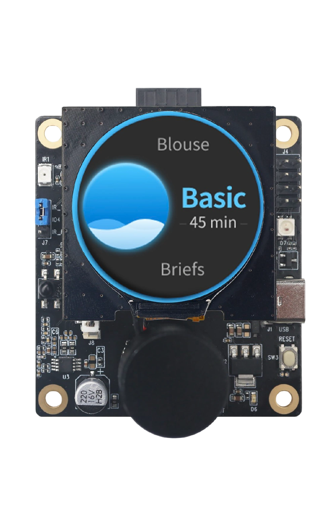 |
| [ESP32-LyraT](bsp/esp32_lyrat) | esp32 | :musical_note: Audio <br/>:microphone: Audio Microphone  (es8388)<br/>:speaker: Audio Speaker  (es8388)<br/>:radio_button: Button <br/>:bulb: LED <br/>:floppy_disk: uSD Card <br/> | 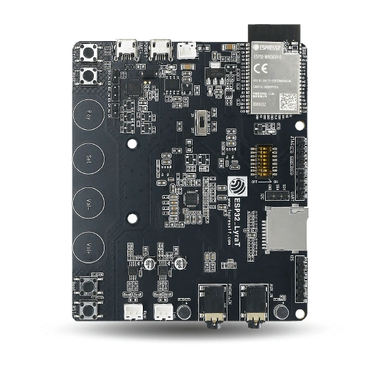 |
| [ESP32-P4-EYE](bsp/esp32_p4_eye) | esp32p4 | :musical_note: Audio <br/>:microphone: Audio Microphone <br/>:battery: Battery <br/>:radio_button: Button <br/>:camera: Camera  (OV2710)<br/>:pager: LCD Display  (st7789)<br/>:white_circle: Knob <br/>:bulb: LED <br/>:floppy_disk: uSD Card <br/> | 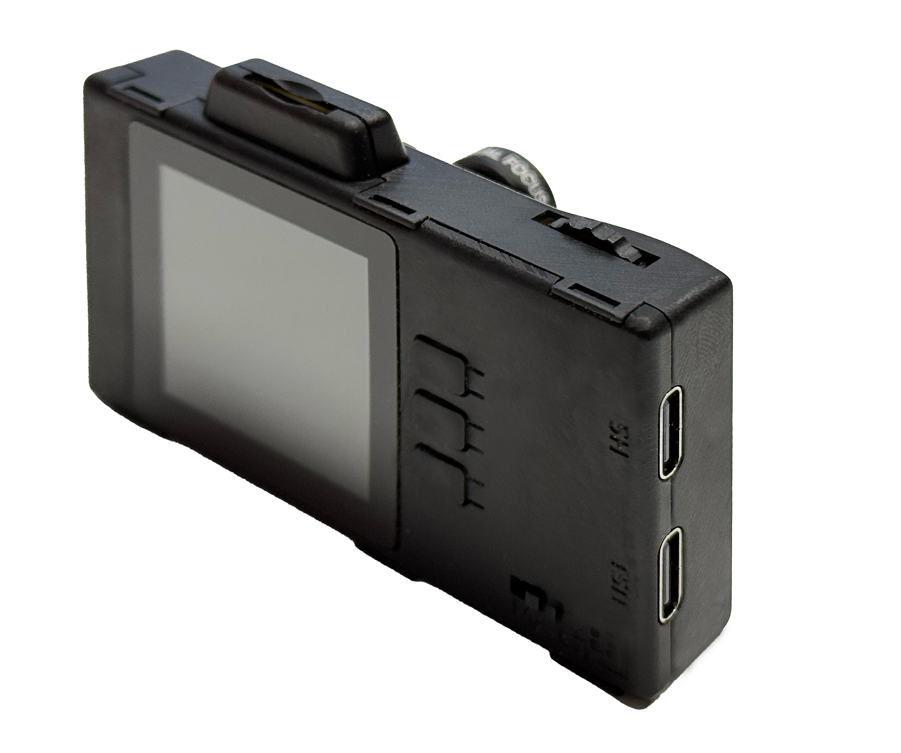 |
| [ESP32-P4 Function EV Board](bsp/esp32_p4_function_ev_board) | esp32p4 | :musical_note: Audio <br/>:microphone: Audio Microphone  (es8311)<br/>:speaker: Audio Speaker  (es8311)<br/>:camera: Camera  (OV5647, SC2336)<br/>:pager: LCD Display  (ek79007, ili9881c, lt8912b)<br/>:floppy_disk: uSD Card <br/>:point_up: Display Touch  (gt911)<br/> | 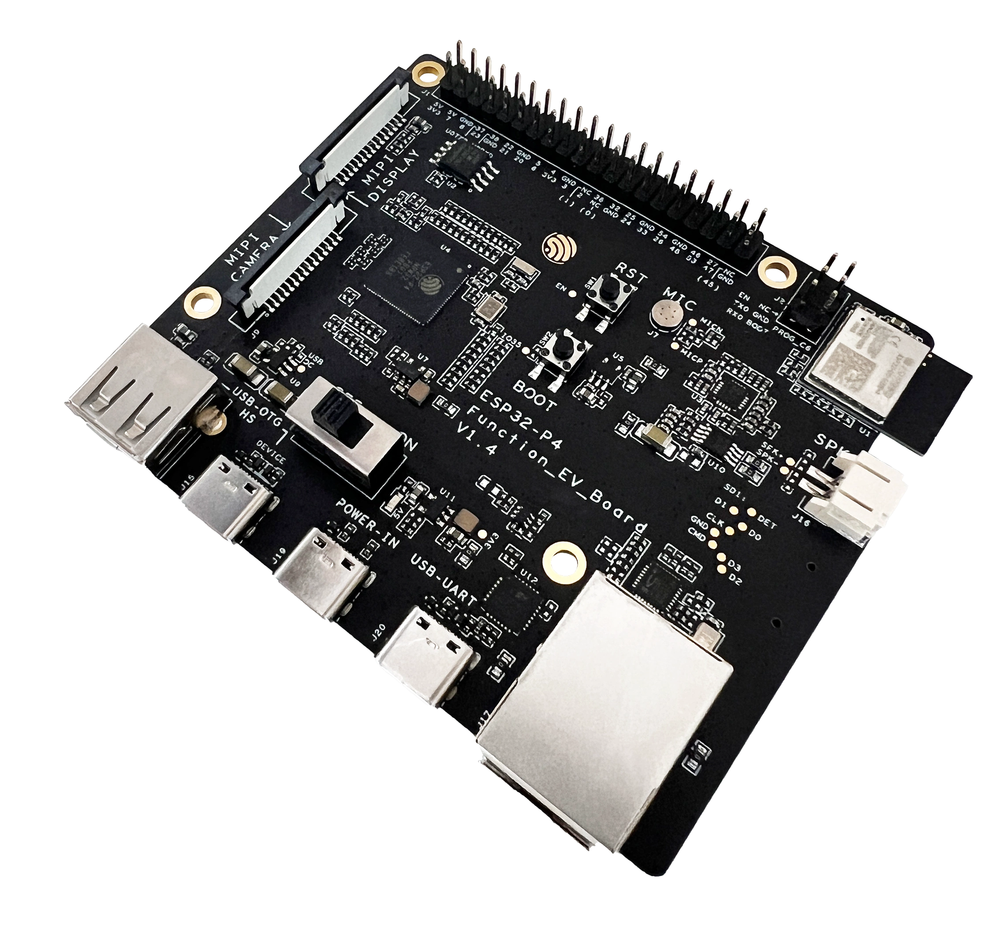 |
| [ESP32-S3-EYE](bsp/esp32_s3_eye) | esp32s3 | :musical_note: Audio <br/>:microphone: Audio Microphone <br/>:radio_button: Button <br/>:camera: Camera <br/>:pager: LCD Display  (st7789)<br/>:video_game: IMU <br/>:floppy_disk: uSD Card <br/> | 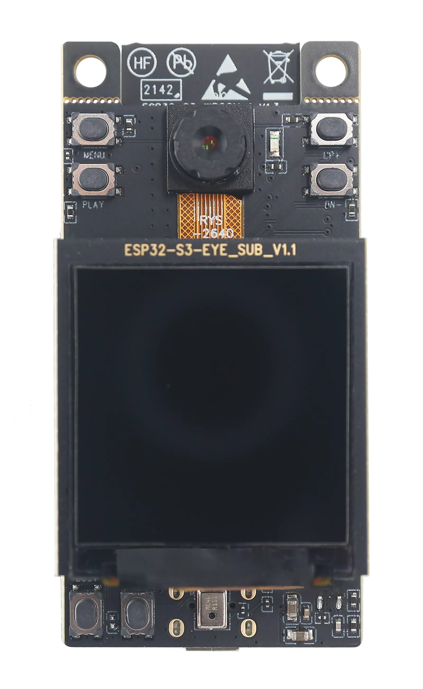 |
| [ESP32-S3-KORVO-1](bsp/esp32_s3_korvo_1) | esp32s3 | :musical_note: Audio <br/>:microphone: Audio Microphone  (es7210)<br/>:speaker: Audio Speaker  (es8311)<br/>:radio_button: Button <br/>:bulb: LED <br/>:floppy_disk: uSD Card <br/> | 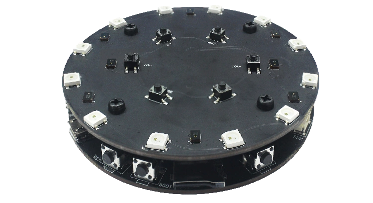 |
| [ESP32-S3-Korvo-2](bsp/esp32_s3_korvo_2) | esp32s3 | :musical_note: Audio <br/>:microphone: Audio Microphone  (es7210)<br/>:speaker: Audio Speaker  (es8311)<br/>:radio_button: Button <br/>:camera: Camera <br/>:pager: LCD Display  (ili9341)<br/>:bulb: LED <br/>:floppy_disk: uSD Card <br/>:point_up: Display Touch  (tt21100)<br/> | 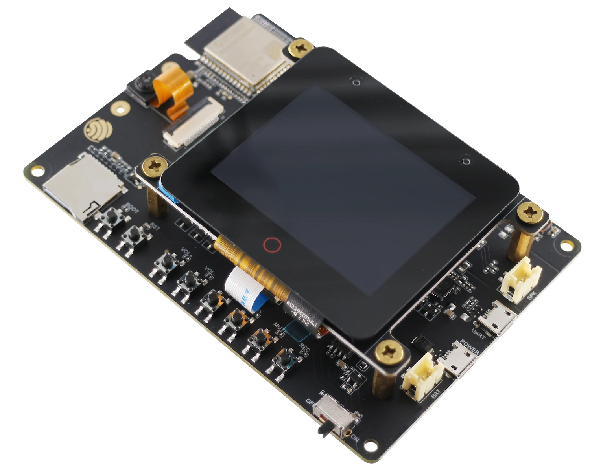 |
| [ESP32-S3-LCD-EV-Board](bsp/esp32_s3_lcd_ev_board) | esp32s3 | :musical_note: Audio <br/>:microphone: Audio Microphone  (es7210)<br/>:speaker: Audio Speaker  (es8311)<br/>:radio_button: Button <br/>:pager: LCD Display <br/>:point_up: Display Touch <br/> | 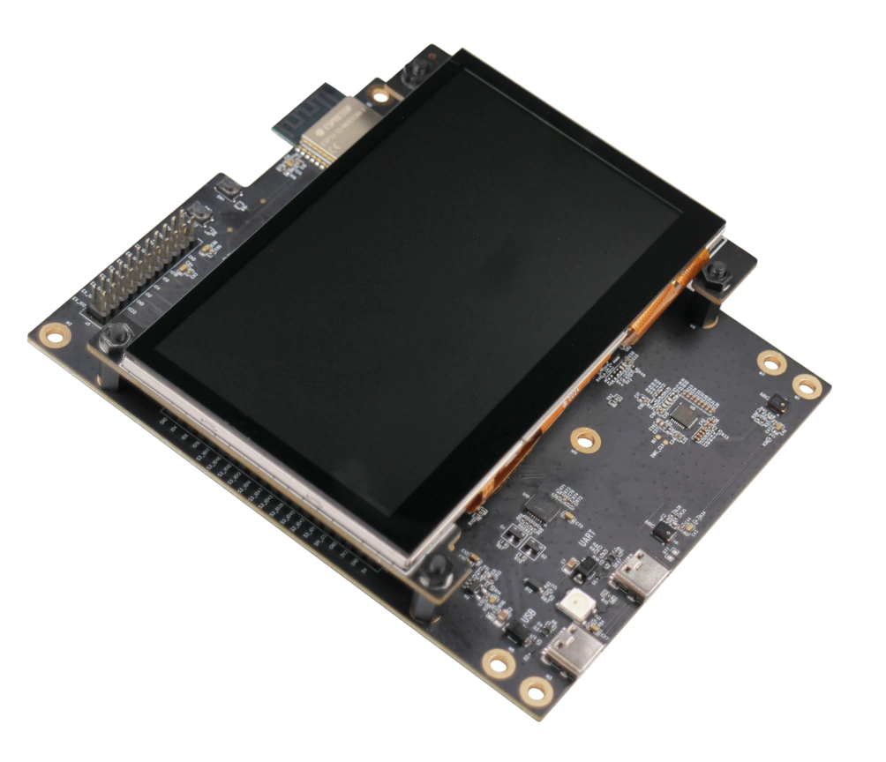 |
| [ESP32-S3-USB-OTG](bsp/esp32_s3_usb_otg) | esp32s3 | :battery: Battery <br/>:radio_button: Button <br/>:pager: LCD Display  (st7789)<br/>:bulb: LED <br/>:floppy_disk: uSD Card <br/> | 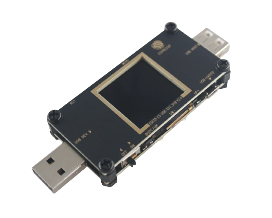 |
| [DevKit BSP](bsp/esp_bsp_devkit) | - | :radio_button: Button <br/>:bulb: LED <br/> | 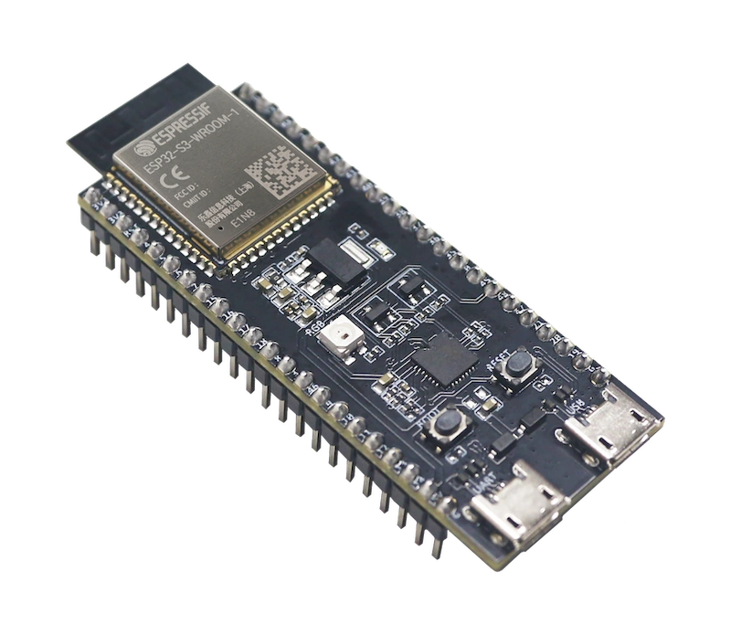 |
| [Generic BSP](bsp/esp_bsp_generic) | - | :radio_button: Button <br/>:pager: LCD Display  (st7789, ili9341, gc9a01)<br/>:bulb: LED <br/>:point_up: Display Touch  (tt21100, gt1151, gt911, cst816s, ft5x06)<br/> |  |
| [ESP-WROVER-KIT](bsp/esp_wrover_kit) | esp32 | :radio_button: Button <br/>:pager: LCD Display  (st7789)<br/>:bulb: LED <br/>:floppy_disk: uSD Card <br/> | 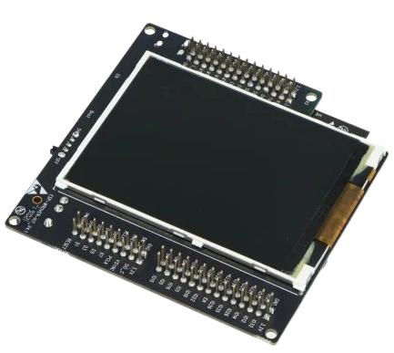 |
| [M5 Atom S3](bsp/m5_atom_s3) | esp32s3 | :radio_button: Button <br/>:pager: LCD Display  (gc9a01)<br/> | 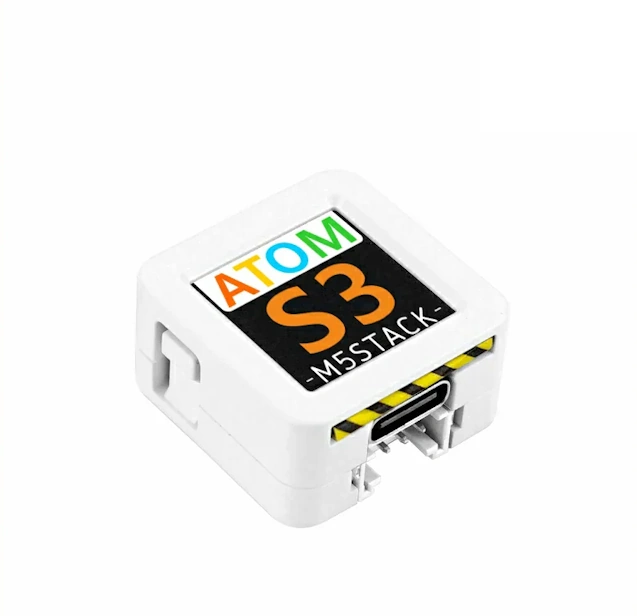 |
| [M5Dial](bsp/m5dial) | esp32s3 | :radio_button: Button <br/>:pager: LCD Display  (gc9a01)<br/>:white_circle: Knob <br/>:point_up: Display Touch  (ft5x06)<br/> | 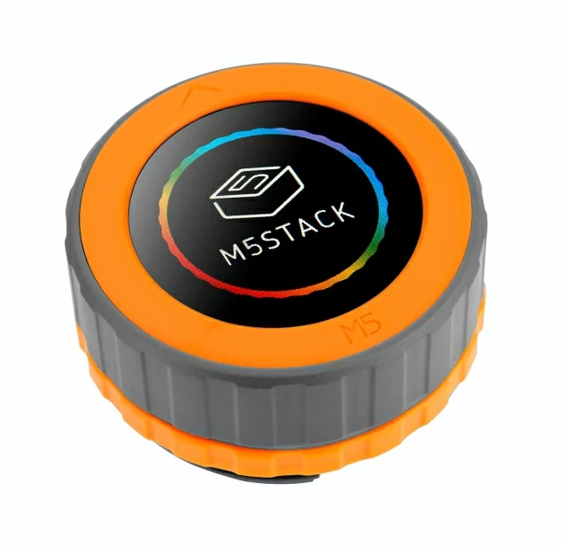 |
| [M5Stack Core](bsp/m5stack_core) | esp32 | :speaker: Audio Speaker <br/>:radio_button: Button <br/>:pager: LCD Display  (ili9341)<br/>:floppy_disk: uSD Card <br/> | 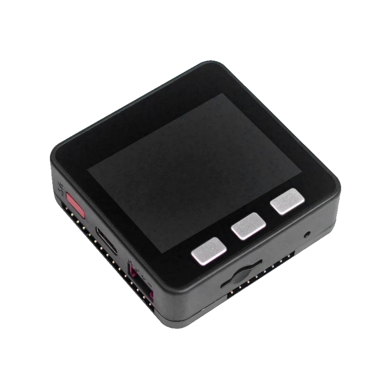 |
| [M5Stack Core2](bsp/m5stack_core_2) | esp32 | :musical_note: Audio <br/>:speaker: Audio Speaker <br/>:pager: LCD Display  (ili9341)<br/>:floppy_disk: uSD Card <br/>:point_up: Display Touch  (ft5x06)<br/> | 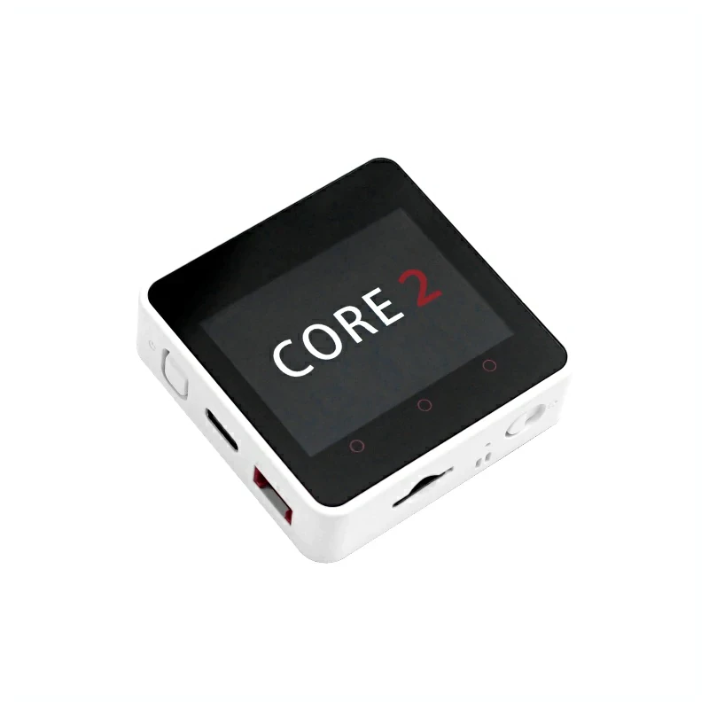 |
| [M5Stack CoreS3](bsp/m5stack_core_s3) | esp32s3 | :musical_note: Audio <br/>:microphone: Audio Microphone  (es7210)<br/>:speaker: Audio Speaker  (aw88298)<br/>:camera: Camera <br/>:pager: LCD Display  (ili9341)<br/>:floppy_disk: uSD Card <br/>:point_up: Display Touch  (ft5x06)<br/> | 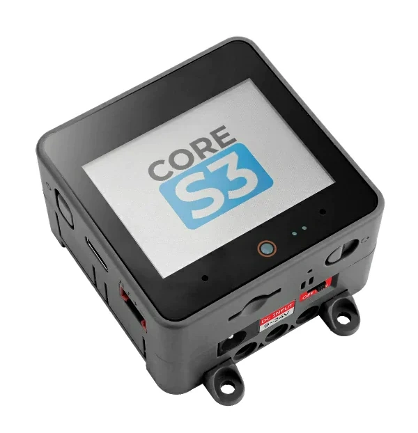 |
| [m5stack_tab5](bsp/m5stack_tab5) | esp32p4 | :musical_note: Audio <br/>:microphone: Audio Microphone  (es7210)<br/>:speaker: Audio Speaker  (es8388)<br/>:camera: Camera  (SC202CS)<br/>:pager: LCD Display  (ili9881c)<br/>:floppy_disk: uSD Card <br/>:point_up: Display Touch  (gt911)<br/> | 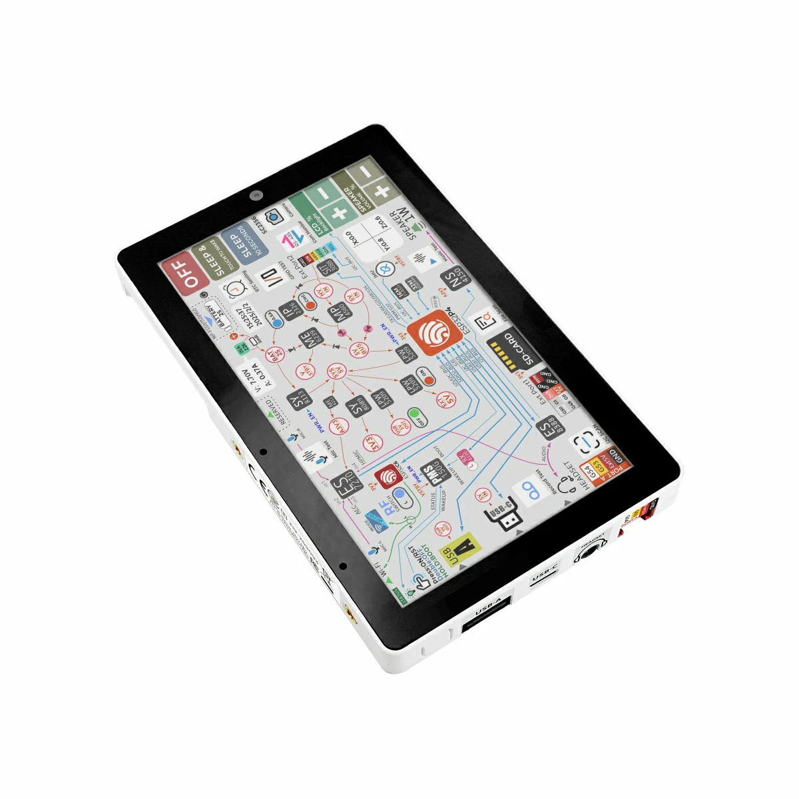 |

### Deprecated Boards

| Board name | SoC | Supported Features | Photo |
|:----------:|:---:|:-------------------|:-----:|
| [ESP-BOX](bsp/esp-box) | esp32s3 | :musical_note: Audio <br/>:microphone: Audio Microphone  (es7210)<br/>:speaker: Audio Speaker  (es8311)<br/>:radio_button: Button <br/>:pager: LCD Display  (st7789)<br/>:video_game: IMU <br/>:point_up: Display Touch  (tt21100)<br/> | 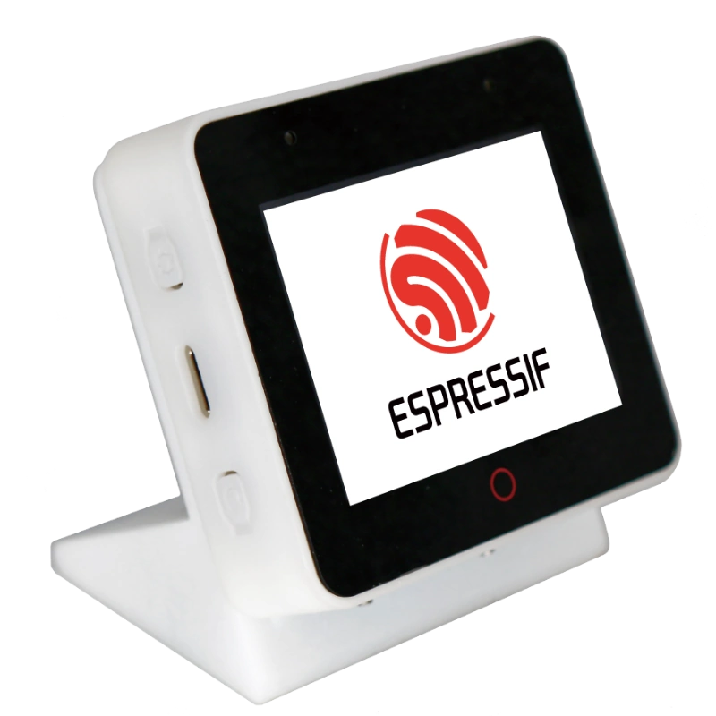 |
| [ESP-BOX-Lite](bsp/esp-box-lite) | esp32s3 | :musical_note: Audio <br/>:microphone: Audio Microphone  (es7243e)<br/>:speaker: Audio Speaker  (es8156)<br/>:radio_button: Button <br/>:pager: LCD Display  (st7789)<br/> |  |
| [ESP32-Azure IoT Kit](bsp/esp32_azure_iot_kit) | esp32 | :radio_button: Button <br/>:pager: LCD Display  (ssd1306)<br/>:video_game: IMU <br/>:bulb: LED <br/>:floppy_disk: uSD Card <br/>:black_circle: SENSOR_HUMIDITY <br/>:black_circle: SENSOR_LIGHT <br/>:black_circle: SENSOR_MAG <br/>:black_circle: SENSOR_PRESSURE <br/>:black_circle: SENSOR_TEMPERATURE <br/> |  |
| [ESP32-S2-Kaluga Kit](bsp/esp32_s2_kaluga_kit) | esp32s2 | :musical_note: Audio <br/>:microphone: Audio Microphone  (es8311)<br/>:speaker: Audio Speaker  (es8311)<br/>:radio_button: Button <br/>:camera: Camera <br/>:pager: LCD Display  (st7789)<br/>:bulb: LED <br/> | 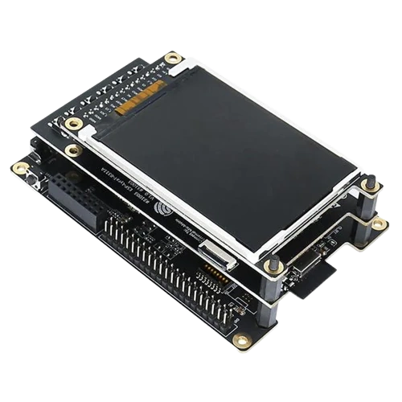 |

<!-- END_SUPPORTED_BOARDS -->

## Examples

The best way to start with **ESP-BSP** is by trying one of the available [examples](examples) on your board.
Each example includes a `README.md` file listing supported boards and usage instructions.

Here is a summary of the available examples:

<!-- EXAMPLES_TABLE_START -->

| Example | Description | Supported Boards | Try with ESP Launchpad |
| ------- | ----------- | ---------------- | ---------------------- |
| [Audio Example](examples/audio) | Play and record WAV file | <details><summary>4 boards</summary>[esp32_lyrat](bsp/esp32_lyrat)<br/>[esp32_s2_kaluga_kit](bsp/esp32_s2_kaluga_kit)<br/>[esp32_s3_korvo_1](bsp/esp32_s3_korvo_1)<br/>[esp32_s3_korvo_2](bsp/esp32_s3_korvo_2)</details> | [Flash Example](https://espressif.github.io/esp-launchpad/?flashConfigURL=https://espressif.github.io/esp-bsp/config.toml&app=audio-) |
| [Display Example](examples/display) | Show an image on the screen with a simple startup animation (LVGL) | <details><summary>18 boards</summary>[esp-box](bsp/esp-box)<br/>[esp-box-3](bsp/esp-box-3)<br/>[esp-box-lite](bsp/esp-box-lite)<br/>[esp32_c3_lcdkit](bsp/esp32_c3_lcdkit)<br/>[esp32_p4_eye](bsp/esp32_p4_eye)<br/>[esp32_p4_function_ev_board](bsp/esp32_p4_function_ev_board)<br/>[esp32_s2_kaluga_kit](bsp/esp32_s2_kaluga_kit)<br/>[esp32_s3_eye](bsp/esp32_s3_eye)<br/>[esp32_s3_korvo_2](bsp/esp32_s3_korvo_2)<br/>[esp32_s3_lcd_ev_board](bsp/esp32_s3_lcd_ev_board)<br/>[esp32_s3_usb_otg](bsp/esp32_s3_usb_otg)<br/>[esp_wrover_kit](bsp/esp_wrover_kit)<br/>[m5_atom_s3](bsp/m5_atom_s3)<br/>[m5dial](bsp/m5dial)<br/>[m5stack_core](bsp/m5stack_core)<br/>[m5stack_core_2](bsp/m5stack_core_2)<br/>[m5stack_core_s3](bsp/m5stack_core_s3)<br/>[m5stack_tab5](bsp/m5stack_tab5)</details> | [Flash Example](https://espressif.github.io/esp-launchpad/?flashConfigURL=https://espressif.github.io/esp-bsp/config.toml&app=display-) |
| [Display, Audio and Photo Example](examples/display_audio_photo) | Complex demo: browse files from filesystem and play/display JPEG, WAV, or TXT files (LVGL) | <details><summary>8 boards</summary>[esp-box](bsp/esp-box)<br/>[esp-box-3](bsp/esp-box-3)<br/>[esp-box-lite](bsp/esp-box-lite)<br/>[esp32_s3_korvo_2](bsp/esp32_s3_korvo_2)<br/>[esp32_s3_lcd_ev_board](bsp/esp32_s3_lcd_ev_board)<br/>[m5stack_core_2](bsp/m5stack_core_2)<br/>[m5stack_core_s3](bsp/m5stack_core_s3)<br/>[m5stack_tab5](bsp/m5stack_tab5)</details> | [Flash Example](https://espressif.github.io/esp-launchpad/?flashConfigURL=https://espressif.github.io/esp-bsp/config.toml&app=display_audio_photo-) |
| [Camera Example](examples/display_camera) | Stream camera output to display (LVGL) | <details><summary>4 boards</summary>[esp32_s2_kaluga_kit](bsp/esp32_s2_kaluga_kit)<br/>[esp32_s3_eye](bsp/esp32_s3_eye)<br/>[esp32_s3_korvo_2](bsp/esp32_s3_korvo_2)<br/>[m5stack_core_s3](bsp/m5stack_core_s3)</details> | [Flash Example](https://espressif.github.io/esp-launchpad/?flashConfigURL=https://espressif.github.io/esp-bsp/config.toml&app=display_camera-) |
| [Camera Example (MIPI-CSI)](examples/display_camera_csi) | Stream camera (MIPI-CSI) output to display (LVGL) | <details><summary>3 boards</summary>[esp32_p4_eye](bsp/esp32_p4_eye)<br/>[esp32_p4_function_ev_board](bsp/esp32_p4_function_ev_board)<br/>[m5stack_tab5](bsp/m5stack_tab5)</details> | [Flash Example](https://espressif.github.io/esp-launchpad/?flashConfigURL=https://espressif.github.io/esp-bsp/config.toml&app=display_camera-) |
| [LVGL Benchmark Example](examples/display_lvgl_benchmark) | Run LVGL benchmark tests | <details><summary>10 boards</summary>[esp-box](bsp/esp-box)<br/>[esp-box-3](bsp/esp-box-3)<br/>[esp-box-lite](bsp/esp-box-lite)<br/>[esp32_p4_function_ev_board](bsp/esp32_p4_function_ev_board)<br/>[esp32_s2_kaluga_kit](bsp/esp32_s2_kaluga_kit)<br/>[esp32_s3_eye](bsp/esp32_s3_eye)<br/>[esp32_s3_korvo_2](bsp/esp32_s3_korvo_2)<br/>[esp32_s3_lcd_ev_board](bsp/esp32_s3_lcd_ev_board)<br/>[m5dial](bsp/m5dial)<br/>[m5stack_core_s3](bsp/m5stack_core_s3)</details> | - |
| [LVGL Demos Example](examples/display_lvgl_demos) | Run the LVGL demo player - all LVGL examples are included (LVGL) | <details><summary>12 boards</summary>[esp-box](bsp/esp-box)<br/>[esp-box-3](bsp/esp-box-3)<br/>[esp-box-lite](bsp/esp-box-lite)<br/>[esp32_p4_eye](bsp/esp32_p4_eye)<br/>[esp32_p4_function_ev_board](bsp/esp32_p4_function_ev_board)<br/>[esp32_s2_kaluga_kit](bsp/esp32_s2_kaluga_kit)<br/>[esp32_s3_eye](bsp/esp32_s3_eye)<br/>[esp32_s3_korvo_2](bsp/esp32_s3_korvo_2)<br/>[esp32_s3_lcd_ev_board](bsp/esp32_s3_lcd_ev_board)<br/>[m5dial](bsp/m5dial)<br/>[m5stack_core_s3](bsp/m5stack_core_s3)<br/>[m5stack_tab5](bsp/m5stack_tab5)</details> | [Flash Example](https://espressif.github.io/esp-launchpad/?flashConfigURL=https://espressif.github.io/esp-bsp/config.toml&app=display_lvgl_demos-) |
| [Display Rotation Example](examples/display_rotation) | Rotate screen using buttons or an accelerometer (`BSP_CAPS_IMU`, if available) | <details><summary>11 boards</summary>[esp-box](bsp/esp-box)<br/>[esp-box-3](bsp/esp-box-3)<br/>[esp-box-lite](bsp/esp-box-lite)<br/>[esp32_p4_eye](bsp/esp32_p4_eye)<br/>[esp32_p4_function_ev_board](bsp/esp32_p4_function_ev_board)<br/>[esp32_s3_korvo_2](bsp/esp32_s3_korvo_2)<br/>[esp32_s3_lcd_ev_board](bsp/esp32_s3_lcd_ev_board)<br/>[m5dial](bsp/m5dial)<br/>[m5stack_core](bsp/m5stack_core)<br/>[m5stack_core_s3](bsp/m5stack_core_s3)<br/>[m5stack_tab5](bsp/m5stack_tab5)</details> | [Flash Example](https://espressif.github.io/esp-launchpad/?flashConfigURL=https://espressif.github.io/esp-bsp/config.toml&app=display_rotation-) |
| [Display SD card Example](examples/display_sdcard) | Example of mounting an SD card using SD-MMC/SPI with display interaction. This example is also supported on boards without a display. | <details><summary>4 boards</summary>[esp-box-3](bsp/esp-box-3)<br/>[esp32_p4_function_ev_board](bsp/esp32_p4_function_ev_board)<br/>[esp32_s3_korvo_2](bsp/esp32_s3_korvo_2)<br/>[m5stack_tab5](bsp/m5stack_tab5)</details> | [Flash Example](https://espressif.github.io/esp-launchpad/?flashConfigURL=https://espressif.github.io/esp-bsp/config.toml&app=display_sdcard) |
| [Sensors Example](examples/display_sensors) | Display sensor data on a monochrome screen (LVGL) | <details><summary>1 board</summary>[esp32_azure_iot_kit](bsp/esp32_azure_iot_kit)</details> | [Flash Example](https://espressif.github.io/esp-launchpad/?flashConfigURL=https://espressif.github.io/esp-bsp/config.toml&app=display_sensors-) |
| [USB HID Example](examples/display_usb_hid) | USB HID demo (keyboard, mouse, or gamepad visualization using LVGL) | <details><summary>3 boards</summary>[esp32_p4_function_ev_board](bsp/esp32_p4_function_ev_board)<br/>[esp32_s3_usb_otg](bsp/esp32_s3_usb_otg)<br/>[m5stack_tab5](bsp/m5stack_tab5)</details> | - |
| [Generic Button and LED Example](examples/generic_button_led) | Minimal example using the Generic BSP: button and LED control | <details><summary>2 boards</summary>[esp_bsp_devkit](bsp/esp_bsp_devkit)<br/>[esp_bsp_generic](bsp/esp_bsp_generic)</details> | - |
| [MQTT Example](examples/mqtt_example) | Collect sensor data and publish to an MQTT server | <details><summary>1 board</summary>[esp32_azure_iot_kit](bsp/esp32_azure_iot_kit)</details> | - |

<!-- EXAMPLES_TABLE_END -->

### BSP headers and options
* `bsp/name-of-the-bsp.h`: Main include file of the BSP with public API
* `bsp/esp-bsp.h`: Convenience include file with the same name for all BPSs
* `bsp/display.h` and `bsp/touch.h`: Only for BSPs with LCD or touch controller. Contain low level initialization functions for usage without LVGL graphical library
    * By default, BSPs with display are shipped with LVGL, if you are interested in BSP without LVGL you can use BSP versions with `noglib` suffix (eg. `esp32_s3_eye_noglib`).

> **_NOTE:_** There can be only one BSP in a single esp-idf project.

### In a custom project
Packages from this repository are uploaded to the [IDF component registry](https://components.espressif.com/).
You can add them to your project via `idf.py add-dependency`, e.g.
```
    idf.py add-dependency esp_wrover_kit==1.0.0
```

### Recommendation for custom projects

When you want to use a BSP in a real project, it is highly recommended to disable configuration option `CONFIG_BSP_ERROR_CHECK` in menuconfig. You should check all returned error codes from all BSP functions you call. Otherwise, if the option `CONFIG_BSP_ERROR_CHECK` is enabled, any error encountered in a BSP will abort the program.

### Compiling project for multiple BSPs

> :warning: **Experimental feature**: This feature is under development!

A single project can be run on multiple different development boards, if the boards contain the features required by the project (such as audio, display, camera...).
For this purpose, `idf.py` is extended by [examples/bsp_ext.py](examples/bsp_ext.py) which allows you to build an example for your specific BSP. Example command for [display](examples/display) e.g.:
```
idf.py -D SDKCONFIG_DEFAULTS=sdkconfig.bsp.esp_wrover_kit build
```

In case you want to build locally for multiple boards at the same time, it is useful to have separate build directories for each BSP configuration.
In order to achieve this, you can extend the above command like this:
```
idf.py -B build/wrover_kit -D SDKCONFIG_DEFAULTS=sdkconfig.bsp.esp_wrover_kit build
```
> Note: This feature is not yet integrated to idf.py by default. If you want to use it, you must set your environmental variable `IDF_EXTRA_ACTIONS_PATH` to path to `esp-bsp/examples/bsp_ext.py`.

## Copyrights and License

All original source code in this repository is Copyright (c) Espressif Systems (Shanghai) Co. Ltd., and is licensed under the Apache 2.0 license.
