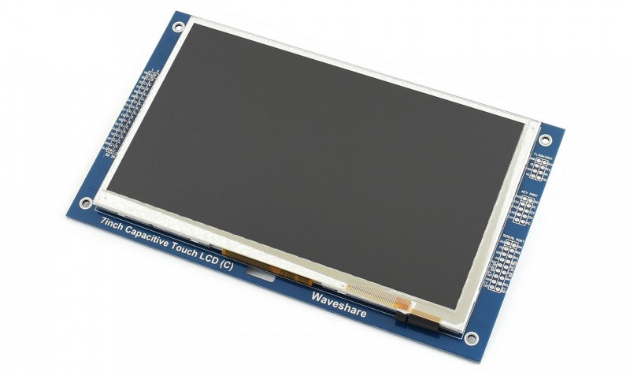

# BSP: Custom WaveShare 7inch LCD 

* [Hardware Reference](https://www.waveshare.com/wiki/7inch_Capacitive_Touch_LCD_(C))

This is an example how to make custom BSP and generate custom board for SquareLine Studio.

WaveShare 7inch Capacitive Touch LCD (C) 800x480

* INTERFACE: 8080 series interface
* LCD CONTROLLER: RA8875
* TOUCH CONTROLLER: GT911
* RESOLUTION: 800 * 480 (Pixel)

## Default Hardware Connection

### PARALLEL INTEL 8080 Display

| Display |    ESP32-S3   |
| :-----: | :-----------: |
|   CS    |     **GND**   |
| RS/DC   |   GPIO 37     |
|   WR    |   GPIO 38     |
|   RD    |    **3V3**    |
|   RST   |   GPIO 39     |
|   PS    |    **GND**    |
|   WAIT  |   GPIO 1      |
|   D0    |   GPIO 13     |
|   D1    |   GPIO 12     |
|   D2    |   GPIO 11     |
|   D3    |   GPIO 10     |
|   D4    |   GPIO 9      |
|   D5    |   GPIO 46     |
|   D6    |   GPIO 3      |
|   D7    |   GPIO 8      |
|   D8    |   GPIO 18     |
|   D9    |   GPIO 17     |
|   D10   |   GPIO 16     |
|   D11   |   GPIO 15     |
|   D12   |   GPIO 7      |
|   D13   |   GPIO 6      |
|   D14   |   GPIO 5      |
|   D15   |   GPIO 4      |
| D8 ~ D15|    **GND**    |

### I2C Touch

| Display |    ESP32-S2   |
| :-----: | :-----------: |
|   SCL   |   GPIO 41     |
|   SDA   |   GPIO 42     |
|   INT   |   GPIO 2      |
