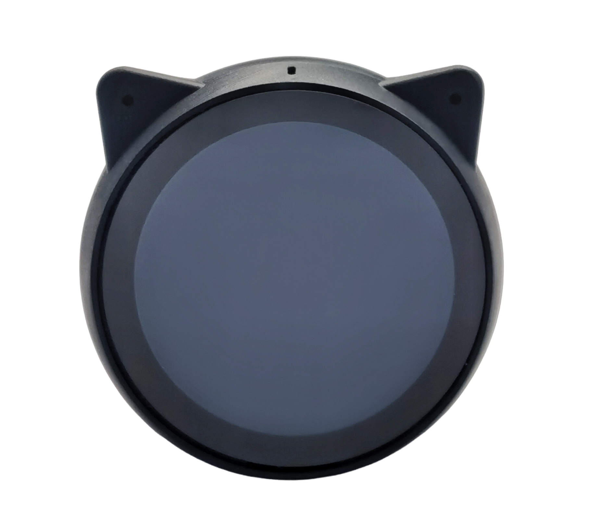
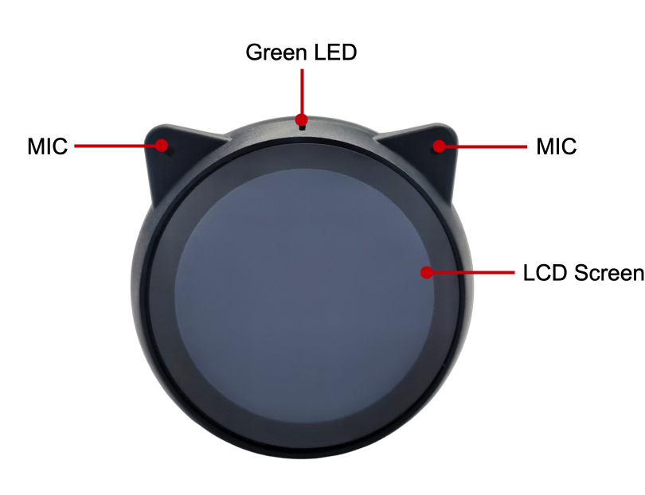
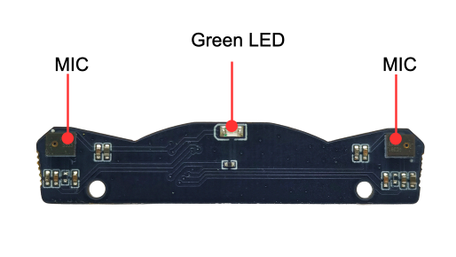
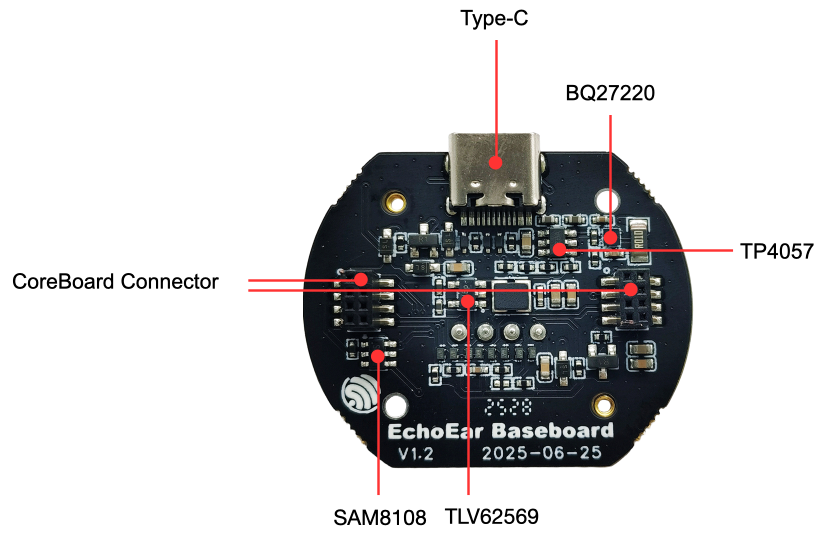
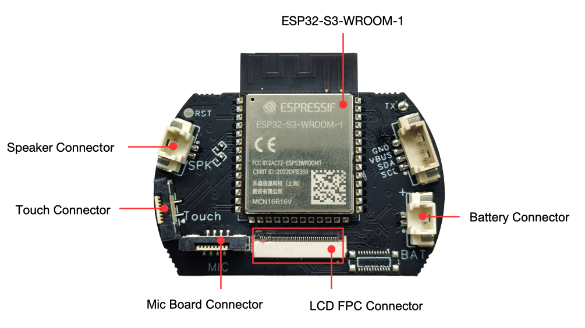

# BSP: EchoEar

| [HW Reference](https://docs.espressif.com/projects/esp-dev-kits/en/latest/esp32s3/echoear/user_guide_v1.2.html) | [HOW TO USE API](API.md) | [EXAMPLES](#compatible-bsp-examples) |  |  |
| --- | --- |

## Overview

<table>
<tr><td>

EchoEar is an intelligent AI development kit. It is suitable for voice interaction products that require large model capabilities, such as toys, smart speakers, and smart central control systems. The device is equipped with a 1.85-inch QSPI circular touch screen, dual microphone array, and supports offline voice wake-up and sound source localization algorithms. Combined with the large model capabilities provided by OpenAI，Xiaozhi AI, Gemini, etc., EchoEar can achieve full-duplex voice interaction, multimodal recognition, and intelligent agent control, providing a solid foundation for developers to create complete edge-side AI application experiences.

</td><td width="200" valign="top">
  
</td></tr>
</table>

<table>
<tr><td>
  
</td><td>
  
</td></tr>
<tr><td>
  
</td><td>
  
</td></tr>
</table>

## Capabilities and dependencies

<!-- START_DEPENDENCIES -->

|     Available    |       Capability       |Controller/Codec|                                                   Component                                                  |   Version  |
|------------------|------------------------|----------------|--------------------------------------------------------------------------------------------------------------|------------|
|:heavy_check_mark:|     :pager: DISPLAY    |     st77916    |  idf [espressif/esp_lcd_st77916](https://components.espressif.com/components/espressif/esp_lcd_st77916)  | >=5.5 *|
|:heavy_check_mark:|:black_circle: LVGL_PORT|                |        [espressif/esp_lvgl_port](https://components.espressif.com/components/espressif/esp_lvgl_port)        |     ^2     |
|:heavy_check_mark:|    :point_up: TOUCH    |     cst816s    |[espressif/esp_lcd_touch_cst816s](https://components.espressif.com/components/espressif/esp_lcd_touch_cst816s)|      *     |
|:heavy_check_mark:| :radio_button: BUTTONS |                |               [espressif/button](https://components.espressif.com/components/espressif/button)               |     ^4     |
|        :x:       |   :white_circle: KNOB  |                |                                                                                                              |            |
|:heavy_check_mark:|  :musical_note: AUDIO  |                |        [espressif/esp_codec_dev](https://components.espressif.com/components/espressif/esp_codec_dev)        |    ~1.5    |
|:heavy_check_mark:| :speaker: AUDIO_SPEAKER|     es8311     |                                                                                                              |            |
|:heavy_check_mark:| :microphone: AUDIO_MIC |     es7210     |                                                                                                              |            |
|:heavy_check_mark:|  :floppy_disk: SDCARD  |                |                                                      idf                                                     |    >=5.5   |
|:heavy_check_mark:|       :bulb: LED       |                |    idf [espressif/led_indicator](https://components.espressif.com/components/espressif/led_indicator)    |>=5.5 ^2|
|        :x:       |     :camera: CAMERA    |                |                                                                                                              |            |
|        :x:       |      :battery: BAT     |                |                                                                                                              |            |
|        :x:       |    :video_game: IMU    |                |                                                                                                              |            |

<!-- END_DEPENDENCIES -->

## Compatible BSP Examples

<!-- START_EXAMPLES -->

| Example | Description | Try with ESP Launchpad |
| ------- | ----------- | ---------------------- |
| [Display Example](https://github.com/espressif/esp-bsp/tree/master/examples/display) | Show an image on the screen with a simple startup animation (LVGL) | [Flash Example](https://espressif.github.io/esp-launchpad/?flashConfigURL=https://espressif.github.io/esp-bsp/config.toml&app=display-) |
| [Display, Audio and Photo Example](https://github.com/espressif/esp-bsp/tree/master/examples/display_audio_photo) | Complex demo: browse files from filesystem and play/display JPEG, WAV, or TXT files (LVGL) | [Flash Example](https://espressif.github.io/esp-launchpad/?flashConfigURL=https://espressif.github.io/esp-bsp/config.toml&app=display_audio_photo-) |
| [LVGL Demos Example](https://github.com/espressif/esp-bsp/tree/master/examples/display_lvgl_demos) | Run the LVGL demo player - all LVGL examples are included (LVGL) | [Flash Example](https://espressif.github.io/esp-launchpad/?flashConfigURL=https://espressif.github.io/esp-bsp/config.toml&app=display_lvgl_demos-) |
| [Display Rotation Example](https://github.com/espressif/esp-bsp/tree/master/examples/display_rotation) | Rotate screen using buttons or an accelerometer (`BSP_CAPS_IMU`, if available) | [Flash Example](https://espressif.github.io/esp-launchpad/?flashConfigURL=https://espressif.github.io/esp-bsp/config.toml&app=display_rotation-) |
| [Display SD card Example](https://github.com/espressif/esp-bsp/tree/master/examples/display_sdcard) | Example of mounting an SD card using SD-MMC/SPI with display interaction. This example is also supported on boards without a display. | [Flash Example](https://espressif.github.io/esp-launchpad/?flashConfigURL=https://espressif.github.io/esp-bsp/config.toml&app=display_sdcard) |

<!-- END_EXAMPLES -->

