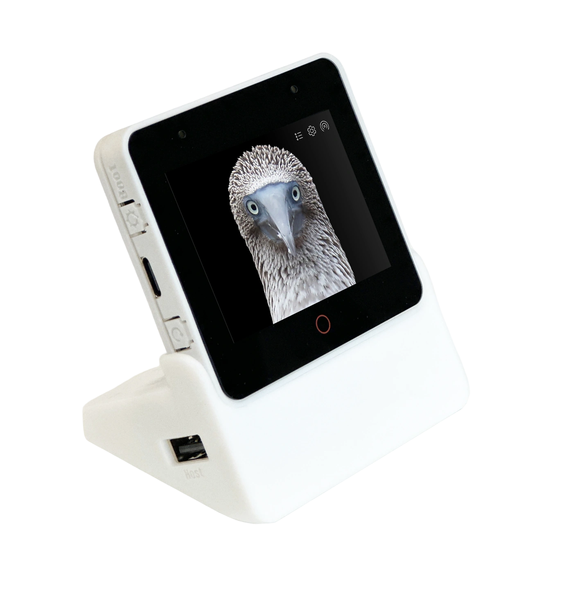
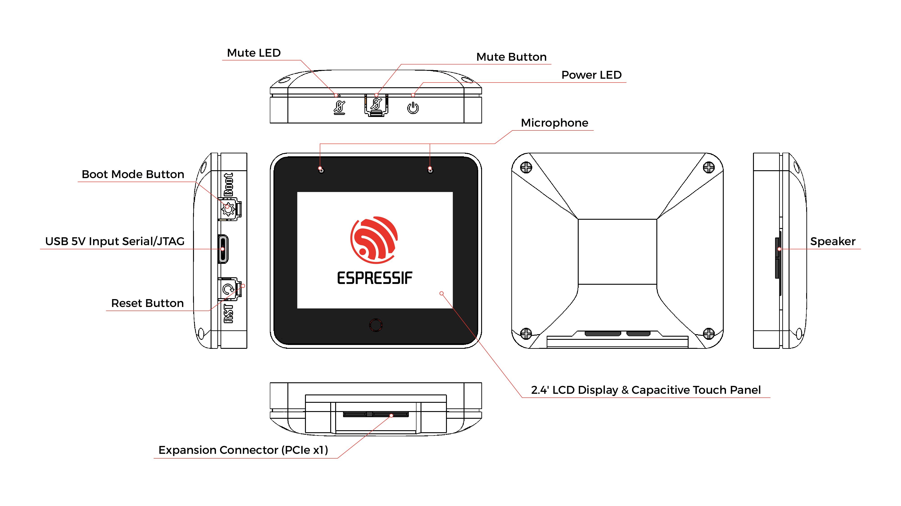

# BSP: ESP-BOX-3

| [HW Reference](https://github.com/espressif/esp-box/tree/master/hardware) | [HOW TO USE API](API.md) | [EXAMPLES](#compatible-bsp-examples) |  |  |
| --- | --- | --- | --- | --- |

## Overview

<table>
<tr><td>

ESP32-S3-BOX-3 is an AI voice development kit that is based on Espressif’s ESP32-S3 Wi-Fi + Bluetooth 5 (LE) SoC, with AI capabilities. In addition to ESP32-S3’s 512KB SRAM,

ESP32-S3-BOX-3 comes with 16MB of QSPI flash and 16MB of Octal PSRAM. ESP32-S3-BOX-3 is also equipped with a variety of peripherals, such as a 2.4-inch display with a 320x240 resolution, a capacitive touch screen, a dual microphone, a speaker, and two Pmod™-compatible headers which allow for the extensibility of the hardware.

ESP32-S3-BOX-3 also uses a Type-C USB connector that provides 5 V of power input, while also supporting serial and JTAG debugging, as well as a programming interface; all through the same connector.

</td><td width="200" valign="top">
  
</td></tr>
</table>

## Capabilities and dependencies

<!-- START_DEPENDENCIES -->

|     Available    |       Capability       |Controller/Codec|                                                                                                          Component                                                                                                          |     Version    |
|------------------|------------------------|----------------|-----------------------------------------------------------------------------------------------------------------------------------------------------------------------------------------------------------------------------|----------------|
|:heavy_check_mark:|     :pager: DISPLAY    | st7789, ili9341|                                                          idf [espressif/esp_lcd_ili9341](https://components.espressif.com/components/espressif/esp_lcd_ili9341)                                                         |>=5.3 ^2.0.1|
|:heavy_check_mark:|:black_circle: LVGL_PORT|                |                                                                [espressif/esp_lvgl_port](https://components.espressif.com/components/espressif/esp_lvgl_port)                                                               |       ^2       |
|:heavy_check_mark:|    :point_up: TOUCH    | tt21100, gt911 |[espressif/esp_lcd_touch_tt21100](https://components.espressif.com/components/espressif/esp_lcd_touch_tt21100) [espressif/esp_lcd_touch_gt911](https://components.espressif.com/components/espressif/esp_lcd_touch_gt911)|    ^1 ^1   |
|:heavy_check_mark:| :radio_button: BUTTONS |                |                                                                       [espressif/button](https://components.espressif.com/components/espressif/button)                                                                      |       ^4       |
|:heavy_check_mark:|  :musical_note: AUDIO  |                |                                                                [espressif/esp_codec_dev](https://components.espressif.com/components/espressif/esp_codec_dev)                                                               |      ~1.5      |
|:heavy_check_mark:| :speaker: AUDIO_SPEAKER|     es8311     |                                                                                                                                                                                                                             |                |
|:heavy_check_mark:| :microphone: AUDIO_MIC |     es7210     |                                                                                                                                                                                                                             |                |
|:heavy_check_mark:|  :floppy_disk: SDCARD  |                |                                                                                                             idf                                                                                                             |      >=5.3     |
|:heavy_check_mark:|    :video_game: IMU    |                |                                                                     [espressif/icm42670](https://components.espressif.com/components/espressif/icm42670)                                                                    |     ^2.0.2     |
|:heavy_check_mark:| :thermometer: HUMITURE |                |                                                                        [espressif/aht30](https://components.espressif.com/components/espressif/aht30)                                                                       |     ^1.0.0     |

<!-- END_DEPENDENCIES -->

## Compatible BSP Examples

<!-- START_EXAMPLES -->

| Example | Description | Try with ESP Launchpad |
| ------- | ----------- | ---------------------- |
| [Display Example](https://github.com/espressif/esp-bsp/tree/master/examples/display) | Show an image on the screen with a simple startup animation (LVGL) | [Flash Example](https://espressif.github.io/esp-launchpad/?flashConfigURL=https://espressif.github.io/esp-bsp/config.toml&app=display-) |
| [Display, Audio and Photo Example](https://github.com/espressif/esp-bsp/tree/master/examples/display_audio_photo) | Complex demo: browse files from filesystem and play/display JPEG, WAV, or TXT files (LVGL) | [Flash Example](https://espressif.github.io/esp-launchpad/?flashConfigURL=https://espressif.github.io/esp-bsp/config.toml&app=display_audio_photo-) |
| [LVGL Benchmark Example](https://github.com/espressif/esp-bsp/tree/master/examples/display_lvgl_benchmark) | Run LVGL benchmark tests | - |
| [LVGL Demos Example](https://github.com/espressif/esp-bsp/tree/master/examples/display_lvgl_demos) | Run the LVGL demo player - all LVGL examples are included (LVGL) | [Flash Example](https://espressif.github.io/esp-launchpad/?flashConfigURL=https://espressif.github.io/esp-bsp/config.toml&app=display_lvgl_demos-) |
| [Display Rotation Example](https://github.com/espressif/esp-bsp/tree/master/examples/display_rotation) | Rotate screen using buttons or an accelerometer (`BSP_CAPS_IMU`, if available) | [Flash Example](https://espressif.github.io/esp-launchpad/?flashConfigURL=https://espressif.github.io/esp-bsp/config.toml&app=display_rotation-) |
| [Display SD card Example](https://github.com/espressif/esp-bsp/tree/master/examples/display_sdcard) | Example of mounting an SD card using SD-MMC/SPI with display interaction. This example is also supported on boards without a display. | [Flash Example](https://espressif.github.io/esp-launchpad/?flashConfigURL=https://espressif.github.io/esp-bsp/config.toml&app=display_sdcard) |
| [Sensors Example](https://github.com/espressif/esp-bsp/tree/master/examples/display_sensors) | Acquire sensor data using the sensor hub component | [Flash Example](https://espressif.github.io/esp-launchpad/?flashConfigURL=https://espressif.github.io/esp-bsp/config.toml&app=display_sensors) |

<!-- END_EXAMPLES -->

## LVGL Benchmark results

[More results in Grafana](https://metrics.espressif.tools/d/peplfv2/esp-bsp-lvgl-benchmark-table?orgId=1&from=now-90d&to=now&timezone=browser&var-timestamp=2026-05-30T20:38:23.324000000Z&var-board=esp_box_3&var-idf_version=release-v5.5&var-lvgl_version=9.5.0&var-bucket=esp-metrics-longterm)

<iframe src="http://https://metrics.espressif.tools/d-solo/peplfv2/espbsp-lvgl-benchmark-table?orgId=1&from=1772541239768&to=1780313639768&timezone=browser&var-timestamp=2026-05-30T20:38:23.324000000Z&var-board=esp_box_3&var-idf_version=release-v5.5&var-lvgl_version=9.5.0&var-bucket=esp-metrics-longterm&panelId=panel-3&__feature.dashboardSceneSolo=true" width="450" height="200" frameborder="0"></iframe>
