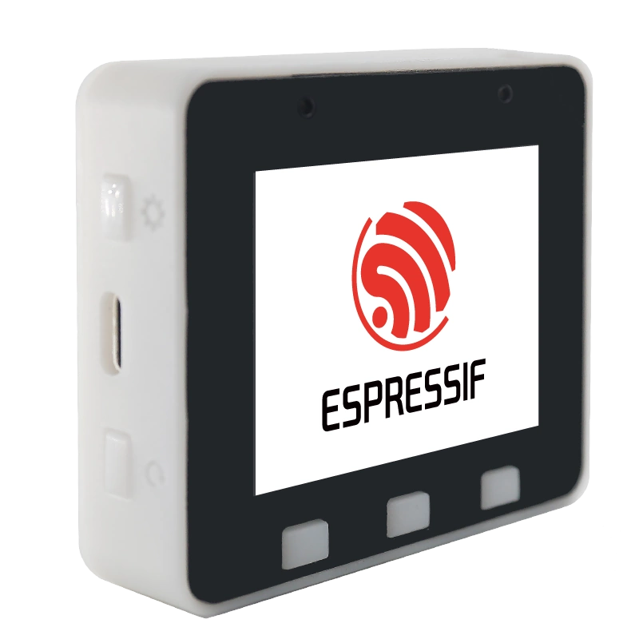

# BSP: ESP-BOX-Lite

| [HW Reference](https://github.com/espressif/esp-box/tree/master/hardware) | [HOW TO USE API](API.md) | [EXAMPLES](#compatible-bsp-examples) |  |  |
| --- | --- | --- | --- | -- |

:warning: **ESP-BOX-Lite is deprecated. This BSP is provided as-is with no further development and compatibility maintenance**

## Overview

<table>
<tr><td>

ESP32-S3-BOX-Lite is an AI voice development kit that is based on Espressif’s ESP32-S3 Wi-Fi + Bluetooth 5 (LE) SoC, with AI capabilities. In addition to ESP32-S3’s 512KB SRAM, ESP32-S3-BOX-Lite comes with 16MB of QSPI flash and 8MB of Octal PSRAM. It is also equipped with a variety of peripherals, such as a 2.4-inch display with a 320x240 resolution, a microphone, a speaker, and two Pmod™-compatible headers which allow for the extensibility of the hardware.

ESP32-S3-BOX-Lite also uses a Type-C USB connector that provides 5 V of power input, while also supporting serial and JTAG debugging, as well as a programming interface; all through the same connector.

</td><td width="200">
  
</td></tr>
</table>

## Capabilities and dependencies

<!-- START_DEPENDENCIES -->

|     Available    |       Capability       |Controller/Codec|                                           Component                                          |   Version  |
|------------------|------------------------|----------------|----------------------------------------------------------------------------------------------|------------|
|:heavy_check_mark:|     :pager: DISPLAY    |     st7789     |                                              idf                                             |>=4.4.5,<6.0|
|:heavy_check_mark:|:black_circle: LVGL_PORT|                |[espressif/esp_lvgl_port](https://components.espressif.com/components/espressif/esp_lvgl_port)|     ^2     |
|        :x:       |    :point_up: TOUCH    |                |                                                                                              |            |
|:heavy_check_mark:| :radio_button: BUTTONS |                |       [espressif/button](https://components.espressif.com/components/espressif/button)       |    ^2.4    |
|:heavy_check_mark:|  :musical_note: AUDIO  |                |[espressif/esp_codec_dev](https://components.espressif.com/components/espressif/esp_codec_dev)|    ~1.1    |
|:heavy_check_mark:| :speaker: AUDIO_SPEAKER|     es8156     |                                                                                              |            |
|:heavy_check_mark:| :microphone: AUDIO_MIC |     es7243e    |                                                                                              |            |
|        :x:       |  :floppy_disk: SDCARD  |                |                                                                                              |            |
|        :x:       |    :video_game: IMU    |                |                                                                                              |            |

<!-- END_DEPENDENCIES -->

## Compatible BSP Examples

<!-- START_EXAMPLES -->

| Example | Description | Try with ESP Launchpad |
| ------- | ----------- | ---------------------- |
| [Display Example](https://github.com/espressif/esp-bsp/tree/master/examples/display) | Show an image on the screen with a simple startup animation (LVGL) | [Flash Example](https://espressif.github.io/esp-launchpad/?flashConfigURL=https://espressif.github.io/esp-bsp/config.toml&app=display-) |
| [Display, Audio and Photo Example](https://github.com/espressif/esp-bsp/tree/master/examples/display_audio_photo) | Complex demo: browse files from filesystem and play/display JPEG, WAV, or TXT files (LVGL) | [Flash Example](https://espressif.github.io/esp-launchpad/?flashConfigURL=https://espressif.github.io/esp-bsp/config.toml&app=display_audio_photo-) |
| [LVGL Benchmark Example](https://github.com/espressif/esp-bsp/tree/master/examples/display_lvgl_benchmark) | Run LVGL benchmark tests | - |
| [LVGL Demos Example](https://github.com/espressif/esp-bsp/tree/master/examples/display_lvgl_demos) | Run the LVGL demo player - all LVGL examples are included (LVGL) | [Flash Example](https://espressif.github.io/esp-launchpad/?flashConfigURL=https://espressif.github.io/esp-bsp/config.toml&app=display_lvgl_demos-) |
| [Display Rotation Example](https://github.com/espressif/esp-bsp/tree/master/examples/display_rotation) | Rotate screen using buttons or an accelerometer (`BSP_CAPS_IMU`, if available) | [Flash Example](https://espressif.github.io/esp-launchpad/?flashConfigURL=https://espressif.github.io/esp-bsp/config.toml&app=display_rotation-) |

<!-- END_EXAMPLES -->

<!-- START_BENCHMARK -->
<!-- END_BENCHMARK -->
