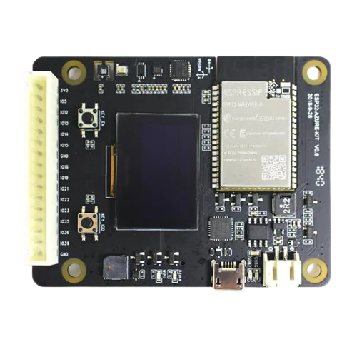

# BSP: ESP32-Azure-IoT-Kit

| [HW Reference](https://www.espressif.com/en/products/devkits/esp32-azure-kit/hardware/) | [HOW TO USE API](API.md) | [EXAMPLES](#compatible-bsp-examples) |  |  |
| --- | --- | --- | --- | -- |

:warning: **ESP32-Azure-IoT-Kit is deprecated. This BSP is provided as-is with no further development and compatibility maintenance**

## Overview

<table>
<tr><td>

ESP32-Azure IoT Kit has integrated an ESP32-WROVER-B module, serial port-to-USB bridge, lithium battery, charge management IC, 0.96" OLED display, MicroSD card slot, buzzer, multiple sensors, touch buttons, LEDs and other hardware resources.

**Board support package consists of:**
* uSD card interface
* I2C interface
* LEDs, button and buzzer interface
* Sensors software components: MAG3110, HTS221, BH1750, FBM320 and MPU6050
* Display software component: SSD1306

</td><td width="200">
  
</td></tr>
</table>

## Capabilities and dependencies

<!-- START_DEPENDENCIES -->

|     Available    |            Capability           |Controller/Codec|                                           Component                                          |Version|
|------------------|---------------------------------|----------------|----------------------------------------------------------------------------------------------|-------|
|:heavy_check_mark:|         :pager: DISPLAY         |     ssd1306    |                                              idf                                             |>=4.4.5|
|:heavy_check_mark:|     :black_circle: LVGL_PORT    |                |[espressif/esp_lvgl_port](https://components.espressif.com/components/espressif/esp_lvgl_port)|   ^2  |
|        :x:       |         :point_up: TOUCH        |                |                                                                                              |       |
|:heavy_check_mark:|      :radio_button: BUTTONS     |                |       [espressif/button](https://components.espressif.com/components/espressif/button)       |   ^4  |
|        :x:       |       :musical_note: AUDIO      |                |                                                                                              |       |
|        :x:       |     :speaker: AUDIO_SPEAKER     |                |                                                                                              |       |
|        :x:       |      :microphone: AUDIO_MIC     |                |                                                                                              |       |
|:heavy_check_mark:|            :bulb: LED           |                |                                              idf                                             |>=4.4.5|
|:heavy_check_mark:|       :floppy_disk: SDCARD      |                |                                              idf                                             |>=4.4.5|
|:heavy_check_mark:|         :video_game: IMU        |                |      [espressif/mpu6050](https://components.espressif.com/components/espressif/mpu6050)      | ^1.0.0|
|:heavy_check_mark:|:black_circle: SENSOR_TEMPERATURE|                |       [espressif/hts221](https://components.espressif.com/components/espressif/hts221)       | ^1.1.1|
|:heavy_check_mark:|  :black_circle: SENSOR_HUMIDITY |                |       [espressif/hts221](https://components.espressif.com/components/espressif/hts221)       | ^1.1.1|
|:heavy_check_mark:|  :black_circle: SENSOR_PRESSURE |                |       [espressif/fbm320](https://components.espressif.com/components/espressif/fbm320)       | ^1.0.0|
|:heavy_check_mark:|   :black_circle: SENSOR_LIGHT   |                |       [espressif/bh1750](https://components.espressif.com/components/espressif/bh1750)       | ^1.0.0|
|:heavy_check_mark:|    :black_circle: SENSOR_MAG    |                |      [espressif/mag3110](https://components.espressif.com/components/espressif/mag3110)      | ^1.0.0|

<!-- END_DEPENDENCIES -->

## Compatible BSP Examples

<!-- START_EXAMPLES -->

| Example | Description | Try with ESP Launchpad |
| ------- | ----------- | ---------------------- |
| [Sensors Example](https://github.com/espressif/esp-bsp/tree/master/examples/display_sensors) | Display sensor data on a monochrome screen (LVGL) | [Flash Example](https://espressif.github.io/esp-launchpad/?flashConfigURL=https://espressif.github.io/esp-bsp/config.toml&app=display_sensors-) |
| [MQTT Example](https://github.com/espressif/esp-bsp/tree/master/examples/mqtt_example) | Collect sensor data and publish to an MQTT server | - |

<!-- END_EXAMPLES -->

