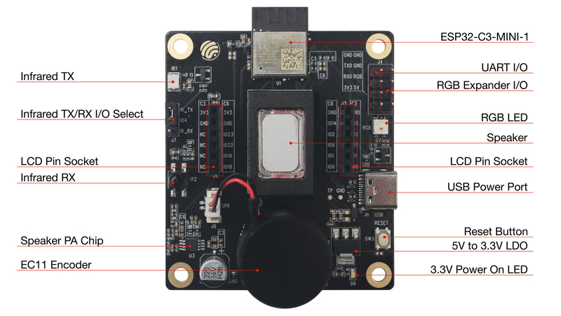

# BSP: ESP32-C3-LCDkit

| [HW Reference](https://docs.espressif.com/projects/espressif-esp-dev-kits/en/latest/esp32c3/esp32-c3-lcdkit/user_guide.html) | [HOW TO USE API](API.md) | [EXAMPLES](#compatible-bsp-examples) |  |  |
| --- | --- | --- | --- | -- |

## Overview

<table>
<tr><td>

ESP32-C3-LCDkit is a development kit that is based on Espressif’s ESP32-C3 Wi-Fi + Bluetooth 5 (LE) SoC.

ESP32-C3-LCDkit comes with 4 MB flash and 400 KB SRAM. ESP32-C3-LCDkit is also equipped with a variety of peripherals, such as a 1.28" LCD screen with SPI interface and 240x240 resolution, a speaker, and IR_RX/IR_TX.

ESP32-C3-LCDkit also uses a Type-C USB connector that provides 5 V of power input, while also supporting serial and JTAG debugging, as well as a programming interface; all through the same connector.

</td><td width="200">
  
</td></tr>
</table>

## Capabilities and dependencies

<!-- START_DEPENDENCIES -->

|     Available    |       Capability       |Controller/Codec|                                                Component                                               |      Version     |
|------------------|------------------------|----------------|--------------------------------------------------------------------------------------------------------|------------------|
|:heavy_check_mark:|     :pager: DISPLAY    |     gc9a01     |[espressif/esp_lcd_gc9a01](https://components.espressif.com/components/espressif/esp_lcd_gc9a01) idf|^2.0.3 >=5.0.0|
|:heavy_check_mark:|:black_circle: LVGL_PORT|                |     [espressif/esp_lvgl_port](https://components.espressif.com/components/espressif/esp_lvgl_port)     |        ^2        |
|        :x:       |    :point_up: TOUCH    |                |                                                                                                        |                  |
|        :x:       | :radio_button: BUTTONS |                |                                                                                                        |                  |
|:heavy_check_mark:|   :white_circle: KNOB  |                |              [espressif/knob](https://components.espressif.com/components/espressif/knob)              |      ^0.1.3      |
|:heavy_check_mark:|  :musical_note: AUDIO  |                |     [espressif/esp_codec_dev](https://components.espressif.com/components/espressif/esp_codec_dev)     |      ^1,<1.2     |
|:heavy_check_mark:| :speaker: AUDIO_SPEAKER|                |                                                                                                        |                  |
|        :x:       | :microphone: AUDIO_MIC |                |                                                                                                        |                  |
|:heavy_check_mark:|       :bulb: LED       |                |                                                   idf                                                  |      >=5.0.0     |
|        :x:       |  :floppy_disk: SDCARD  |                |                                                                                                        |                  |
|        :x:       |    :video_game: IMU    |                |                                                                                                        |                  |

<!-- END_DEPENDENCIES -->

## Compatible BSP Examples

<!-- START_EXAMPLES -->

| Example | Description | Try with ESP Launchpad |
| ------- | ----------- | ---------------------- |
| [Display Example](https://github.com/espressif/esp-bsp/tree/master/examples/display) | Show an image on the screen with a simple startup animation (LVGL) | [Flash Example](https://espressif.github.io/esp-launchpad/?flashConfigURL=https://espressif.github.io/esp-bsp/config.toml&app=display-) |

<!-- END_EXAMPLES -->

<!-- START_BENCHMARK -->
<!-- END_BENCHMARK -->
