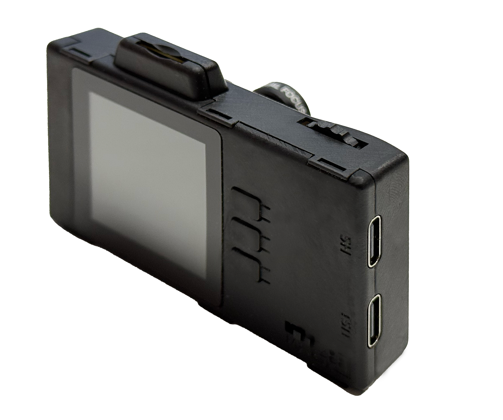

# BSP: ESP32-P4-EYE

| [HW Reference](https://docs.espressif.com/projects/esp-dev-kits/en/latest/esp32p4/esp32-p4-eye/user_guide.html) | [HOW TO USE API](API.md) | [EXAMPLES](#compatible-bsp-examples) |  |  |
| --- | --- | --- | --- | --- |

## Overview

<table>
<tr><td>

ESP32-P4-EYE is a vision development board based on the ESP32-P4 chip, mainly targeting camera applications. ESP32-P4 features a dual-core RISC-V processor and supports up to 32 MB of PSRAM. In addition, ESP32-P4 supports USB 2.0 standard, MIPI-CSI/DSI, H264 Encoder, and various other peripherals. With all of its outstanding features, the board is an ideal choice for developing low-cost, high-performance, low-power network-connected audio and video products.

</td><td width="200" valign="top">
  
</td></tr>
</table>

<table>
<tr><td>
  
</td><td>
  
</td></tr>
</table>

## Capabilities and dependencies

<!-- START_DEPENDENCIES -->

|     Available    |       Capability       |Controller/Codec|                                               Component                                              |   Version  |
|------------------|------------------------|----------------|------------------------------------------------------------------------------------------------------|------------|
|:heavy_check_mark:|     :pager: DISPLAY    |     st7789     |                                                  idf                                                 |    >=5.4   |
|:heavy_check_mark:|:black_circle: LVGL_PORT|                |    [espressif/esp_lvgl_port](https://components.espressif.com/components/espressif/esp_lvgl_port)    |     ^2     |
|        :x:       |    :point_up: TOUCH    |                |                                                                                                      |            |
|:heavy_check_mark:| :radio_button: BUTTONS |                |           [espressif/button](https://components.espressif.com/components/espressif/button)           |     ^4     |
|:heavy_check_mark:|   :white_circle: KNOB  |                |             [espressif/knob](https://components.espressif.com/components/espressif/knob)             |     ^1     |
|:heavy_check_mark:|  :musical_note: AUDIO  |                |    [espressif/esp_codec_dev](https://components.espressif.com/components/espressif/esp_codec_dev)    |    ~1.5    |
|        :x:       | :speaker: AUDIO_SPEAKER|                |                                                                                                      |            |
|:heavy_check_mark:| :microphone: AUDIO_MIC |                |                                                                                                      |            |
|:heavy_check_mark:|  :floppy_disk: SDCARD  |                |                                                  idf                                                 |    >=5.4   |
|:heavy_check_mark:|       :bulb: LED       |                |idf [espressif/led_indicator](https://components.espressif.com/components/espressif/led_indicator)|>=5.4 ^2|
|:heavy_check_mark:|     :camera: CAMERA    |     OV2710     |        [espressif/esp_video](https://components.espressif.com/components/espressif/esp_video)        |    ~1.4    |
|:heavy_check_mark:|      :battery: BAT     |                |                                                  idf                                                 |    >=5.4   |
|        :x:       |    :video_game: IMU    |                |                                                                                                      |            |

<!-- END_DEPENDENCIES -->

## Compatible BSP Examples

<!-- START_EXAMPLES -->

| Example | Description | Try with ESP Launchpad |
| ------- | ----------- | ---------------------- |
| [Display Example](https://github.com/espressif/esp-bsp/tree/master/examples/display) | Show an image on the screen with a simple startup animation (LVGL) | [Flash Example](https://espressif.github.io/esp-launchpad/?flashConfigURL=https://espressif.github.io/esp-bsp/config.toml&app=display-) |
| [Camera Example](https://github.com/espressif/esp-bsp/tree/master/examples/display_camera_video) | Stream camera output to display (LVGL) | [Flash Example](https://espressif.github.io/esp-launchpad/?flashConfigURL=https://espressif.github.io/esp-bsp/config.toml&app=display_camera_video) |
| [LVGL Demos Example](https://github.com/espressif/esp-bsp/tree/master/examples/display_lvgl_demos) | Run the LVGL demo player - all LVGL examples are included (LVGL) | [Flash Example](https://espressif.github.io/esp-launchpad/?flashConfigURL=https://espressif.github.io/esp-bsp/config.toml&app=display_lvgl_demos-) |
| [Display Rotation Example](https://github.com/espressif/esp-bsp/tree/master/examples/display_rotation) | Rotate screen using buttons or an accelerometer (`BSP_CAPS_IMU`, if available) | [Flash Example](https://espressif.github.io/esp-launchpad/?flashConfigURL=https://espressif.github.io/esp-bsp/config.toml&app=display_rotation-) |

<!-- END_EXAMPLES -->

