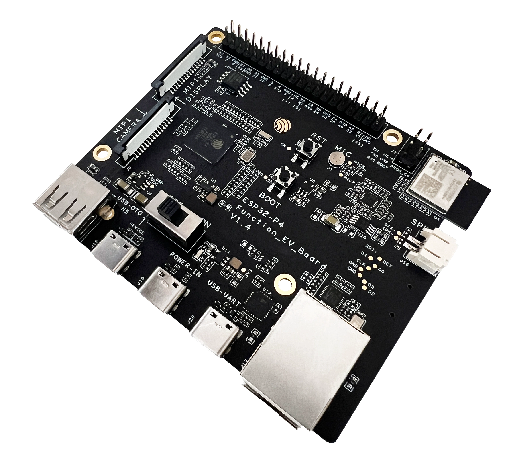
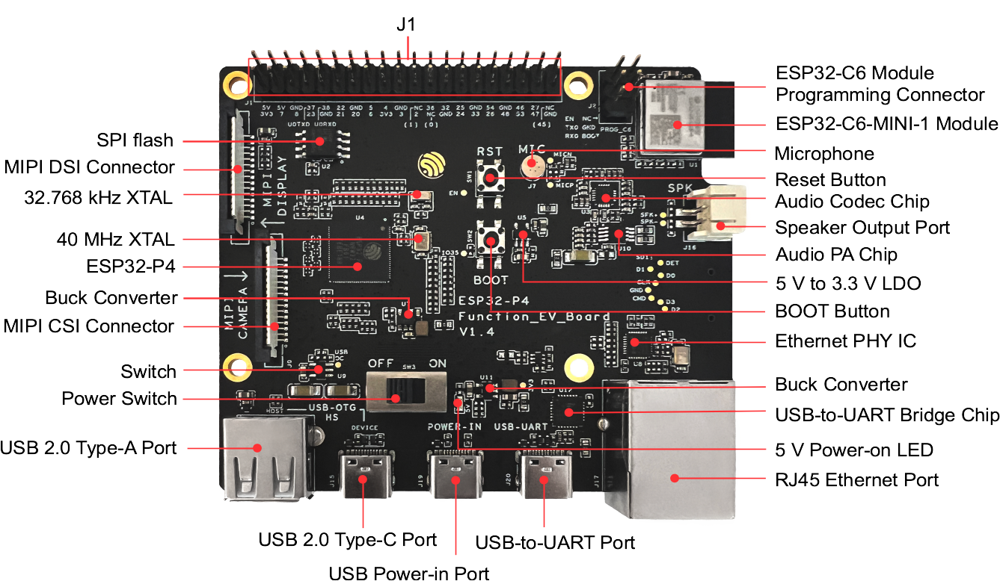

# BSP: ESP32-P4 Function EV Board

| [HW Reference](https://docs.espressif.com/projects/esp-dev-kits/en/latest/esp32p4/esp32-p4-function-ev-board/user_guide.html) | [HOW TO USE API](https://github.com/espressif/esp-bsp/blob/master/docu/how_to_use.md) | [EXAMPLES](#compatible-bsp-examples) |  |  |
| --- | --- | --- | --- | -- |

## Overview

<table>
<tr><td>

ESP32-P4-Function-EV-Board is a multimedia development board based on the ESP32-P4 chip. ESP32-P4 chip features a dual-core 400 MHz RISC-V processor and supports up to 32 MB PSRAM. In addition, ESP32-P4 supports USB 2.0 specification, MIPI-CSI/DSI, H264 Encoder, and various other peripherals. With all of its outstanding features, the board is an ideal choice for developing low-cost, high-performance, low-power network-connected audio and video products.

</td><td width="200">
  
</td></tr>
</table>

## HW Version

| HW version | BSP Version |
| :--------: | :---------: |
|    V1.0    |      ^1     |
|    V1.2    |      ^2     |
|    [V1.4](https://docs.espressif.com/projects/esp-dev-kits/en/latest/esp32p4/esp32-p4-function-ev-board/user_guide.html)    |      ^3     |

## Configuration

Configuration in `menuconfig`.

Selection LCD display `Board Support Package(ESP32-P4) --> Display --> Select LCD type`
- LCD 1280x800 - ili9881c (default)
- LCD 1024x600 - ek79007
- HDMI - lt8912b
    - 800x600@60HZ
    - 1280x720@60HZ
    - 1280x800@60HZ
    - 1920x1080@30HZ

Selection color format `Board Support Package(ESP32-P4) --> Display --> Select LCD color format`
- RGB565 (default)
- RGB888

## HDMI Support

This BSP supports HDMI converter Lontium LT8912B. Follow these rules for using it with HDMI:
- Use ESP-IDF 5.4 or older (from commit [93fdbf2](https://github.com/espressif/esp-idf/commit/93fdbf25b3ea7e44d1f519ed61050847dcc8a076))
- Only RGB888 is supported with HDMI
- Use MIPI-DSI to HDMI converter Lontium LT8912B

## Capabilities and dependencies

<!-- START_DEPENDENCIES -->

|     Available    |       Capability       |     Controller/Codec     |                                                                                                                                                         Component                                                                                                                                                        |                 Version                |
|------------------|------------------------|--------------------------|--------------------------------------------------------------------------------------------------------------------------------------------------------------------------------------------------------------------------------------------------------------------------------------------------------------------------|----------------------------------------|
|:heavy_check_mark:|     :pager: DISPLAY    |ek79007, ili9881c, lt8912b|[espressif/esp_lcd_ek79007](https://components.espressif.com/components/espressif/esp_lcd_ek79007) [espressif/esp_lcd_ili9881c](https://components.espressif.com/components/espressif/esp_lcd_ili9881c) [espressif/esp_lcd_lt8912b](https://components.espressif.com/components/espressif/esp_lcd_lt8912b) idf|1.* 1.* >=0.1.1,<1.0.0 >=5.3|
|:heavy_check_mark:|:black_circle: LVGL_PORT|                          |                                                                                                              [espressif/esp_lvgl_port](https://components.espressif.com/components/espressif/esp_lvgl_port)                                                                                                              |                   ^2                   |
|:heavy_check_mark:|    :point_up: TOUCH    |           gt911          |                                                                                                        [espressif/esp_lcd_touch_gt911](https://components.espressif.com/components/espressif/esp_lcd_touch_gt911)                                                                                                        |                   ^1                   |
|        :x:       | :radio_button: BUTTONS |                          |                                                                                                                                                                                                                                                                                                                          |                                        |
|:heavy_check_mark:|  :musical_note: AUDIO  |                          |                                                                                                              [espressif/esp_codec_dev](https://components.espressif.com/components/espressif/esp_codec_dev)                                                                                                              |                  1.2.*                 |
|:heavy_check_mark:| :speaker: AUDIO_SPEAKER|          es8311          |                                                                                                                                                                                                                                                                                                                          |                                        |
|:heavy_check_mark:| :microphone: AUDIO_MIC |          es8311          |                                                                                                                                                                                                                                                                                                                          |                                        |
|:heavy_check_mark:|  :floppy_disk: SDCARD  |                          |                                                                                                                                                            idf                                                                                                                                                           |                  >=5.3                 |
|        :x:       |    :video_game: IMU    |                          |                                                                                                                                                                                                                                                                                                                          |                                        |

<!-- END_DEPENDENCIES -->

## Compatible BSP Examples

<!-- START_EXAMPLES -->

| Example | Description | Try with ESP Launchpad |
| ------- | ----------- | ---------------------- |
| [Display Example](https://github.com/espressif/esp-bsp/tree/master/examples/display) | Show an image on the screen with a simple startup animation (LVGL) | [Flash Example](https://espressif.github.io/esp-launchpad/?flashConfigURL=https://espressif.github.io/esp-bsp/config.toml&app=display) |
| [LVGL Benchmark Example](https://github.com/espressif/esp-bsp/tree/master/examples/display_lvgl_benchmark) | Run LVGL benchmark tests | - |
| [LVGL Demos Example](https://github.com/espressif/esp-bsp/tree/master/examples/display_lvgl_demos) | Run the LVGL demo player - all LVGL examples are included (LVGL) | [Flash Example](https://espressif.github.io/esp-launchpad/?flashConfigURL=https://espressif.github.io/esp-bsp/config.toml&app=display_lvgl_demo) |
| [Display Rotation Example](https://github.com/espressif/esp-bsp/tree/master/examples/display_rotation) | Rotate screen using buttons or an accelerometer (`BSP_CAPS_IMU`, if available) | [Flash Example](https://espressif.github.io/esp-launchpad/?flashConfigURL=https://espressif.github.io/esp-bsp/config.toml&app=display_rotation) |
| [USB HID Example](https://github.com/espressif/esp-bsp/tree/master/examples/display_usb_hid) | USB HID demo (keyboard, mouse, or gamepad visualization using LVGL) | - |

<!-- END_EXAMPLES -->

<!-- START_BENCHMARK -->

# Benchmark for BOARD esp32_p4_function_ev_board

**DATE:** 06.05.2025 14:44

**LVGL version:** 9.2.2

| Name | Avg. CPU | Avg. FPS | Avg. time | render time | flush time |
| ---- | :------: | :------: | :-------: | :---------: | :--------: |
| Empty screen | 55% *(-6)* | 88  | 6 *(+1)* | 6 *(+1)* | 0  |
| Moving wallpaper | 89% *(-4)* | 71 *(+1)* | 11  | 9 *(+1)* | 2 *(-1)* |
| Single rectangle | 19% *(+1)* | 88 *(-1)* | 1  | 1  | 0  |
| Multiple rectangles | 47%  | 98  | 4 *(-2)* | 2 *(-2)* | 2  |
| Multiple RGB images | 89% *(-7)* | 52 *(+2)* | 14 *(-1)* | 13  | 1 *(-1)* |
| Multiple ARGB images | 99% *(+2)* | 24  | 35  | 33  | 2  |
| Rotated ARGB images | 99% *(-1)* | 3  | 252 *(+5)* | 252 *(+10)* | 0 *(-5)* |
| Multiple labels | 99%  | 33  | 27  | 25  | 2  |
| Screen sized text | 7%  | 90  | 0  | 0  | 0  |
| Multiple arcs | 94%  | 38  | 21  | 19  | 2  |
| Containers | 53% *(-7)* | 89 *(+1)* | 5  | 5  | 0  |
| Containers with overlay | 97% *(+5)* | 17  | 50 *(-1)* | 49  | 1 *(-1)* |
| Containers with opa | 73% *(-1)* | 78  | 9  | 9  | 0  |
| Containers with opa_layer | 97%  | 10  | 85 *(+1)* | 84 *(+1)* | 1  |
| Containers with scrolling | 99%  | 18  | 52 *(+1)* | 49  | 3 *(+1)* |
| Widgets demo | 99%  | 16  | 54  | 52 *(-1)* | 2 *(+1)* |
| All scenes avg. | 75% *(-2)* | 50  | 39 *(+1)* | 38 *(+1)* | 1  |

***

<!-- END_BENCHMARK -->
