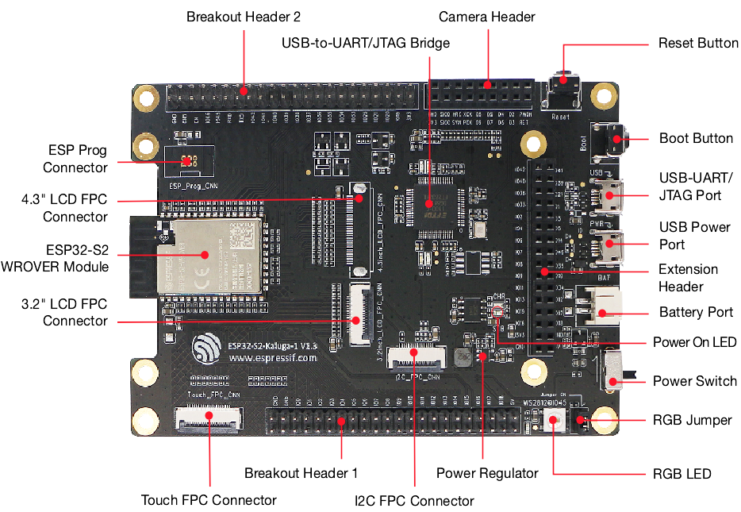

# BSP: ESP32-S2-Kaluga-Kit

| [HW Reference](https://docs.espressif.com/projects/esp-idf/en/latest/esp32s2/hw-reference/esp32s2/user-guide-esp32-s2-kaluga-1-kit.html) | [HOW TO USE API](API.md) | [EXAMPLES](#compatible-bsp-examples) | |  |
| --- | --- | --- | --- | -- |

## Overview

<table>
<tr><td>

The ESP32-S2-Kaluga-1 kit v1.3 is a development kit by Espressif that is mainly created to demonstrate the ESP32-S2’s human-computer interaction functionalities and provide the users with the tools for development of human-computer interaction applications based on the ESP32-S2.

**This Board support package consists of:**
* Smart RGB LED
* LVGL graphics library
* ES8311 mono audio codec
* Touch pad configuration
* Buttons configuration
* Camera driver

</td><td width="200">
  
</td></tr>
</table>

## Capabilities and dependencies

<!-- START_DEPENDENCIES -->

|     Available    |       Capability       |Controller/Codec|                                           Component                                          |Version|
|------------------|------------------------|----------------|----------------------------------------------------------------------------------------------|-------|
|:heavy_check_mark:|     :pager: DISPLAY    |     st7789     |                                              idf                                             | >=5.4 |
|:heavy_check_mark:|:black_circle: LVGL_PORT|                |[espressif/esp_lvgl_port](https://components.espressif.com/components/espressif/esp_lvgl_port)|   ^2  |
|        :x:       |    :point_up: TOUCH    |                |                                                                                              |       |
|:heavy_check_mark:| :radio_button: BUTTONS |                |       [espressif/button](https://components.espressif.com/components/espressif/button)       |   ^4  |
|:heavy_check_mark:|  :musical_note: AUDIO  |                |[espressif/esp_codec_dev](https://components.espressif.com/components/espressif/esp_codec_dev)| ~1.3.1|
|:heavy_check_mark:| :speaker: AUDIO_SPEAKER|     es8311     |                                                                                              |       |
|:heavy_check_mark:| :microphone: AUDIO_MIC |     es8311     |                                                                                              |       |
|:heavy_check_mark:|       :bulb: LED       |                |                                              idf                                             | >=5.4 |
|        :x:       |  :floppy_disk: SDCARD  |                |                                                                                              |       |
|        :x:       |    :video_game: IMU    |                |                                                                                              |       |
|:heavy_check_mark:|     :camera: CAMERA    |                | [espressif/esp32-camera](https://components.espressif.com/components/espressif/esp32-camera) |^2.0.14|

<!-- END_DEPENDENCIES -->

## Compatible BSP Examples

<!-- START_EXAMPLES -->

| Example | Description | Try with ESP Launchpad |
| ------- | ----------- | ---------------------- |
| [Audio Example](https://github.com/espressif/esp-bsp/tree/master/examples/audio) | Play and record WAV file | [Flash Example](https://espressif.github.io/esp-launchpad/?flashConfigURL=https://espressif.github.io/esp-bsp/config.toml&app=audio-) |
| [Display Example](https://github.com/espressif/esp-bsp/tree/master/examples/display) | Show an image on the screen with a simple startup animation (LVGL) | [Flash Example](https://espressif.github.io/esp-launchpad/?flashConfigURL=https://espressif.github.io/esp-bsp/config.toml&app=display-) |
| [Camera Example](https://github.com/espressif/esp-bsp/tree/master/examples/display_camera) | Stream camera output to display (LVGL) | [Flash Example](https://espressif.github.io/esp-launchpad/?flashConfigURL=https://espressif.github.io/esp-bsp/config.toml&app=display_camera-) |
| [LVGL Benchmark Example](https://github.com/espressif/esp-bsp/tree/master/examples/display_lvgl_benchmark) | Run LVGL benchmark tests | - |
| [LVGL Demos Example](https://github.com/espressif/esp-bsp/tree/master/examples/display_lvgl_demos) | Run the LVGL demo player - all LVGL examples are included (LVGL) | [Flash Example](https://espressif.github.io/esp-launchpad/?flashConfigURL=https://espressif.github.io/esp-bsp/config.toml&app=display_lvgl_demos-) |

<!-- END_EXAMPLES -->

<!-- START_BENCHMARK -->
<!-- END_BENCHMARK -->
