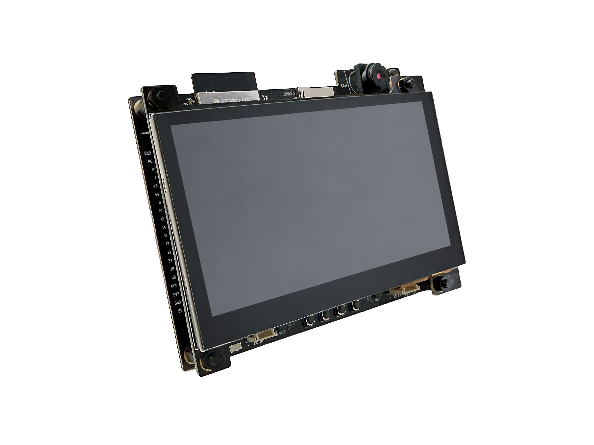
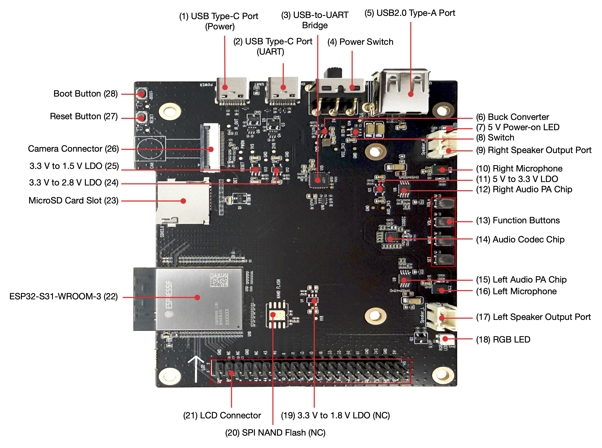

# BSP: ESP32-S31-Korvo-1

| [HW Reference](https://docs.espressif.com/projects/esp-dev-kits/en/latest/esp32s31/esp32-s31-korvo-1/user_guide.html) | [HOW TO USE API](API.md) | [EXAMPLES](#compatible-bsp-examples) |  |  |
| --- | --- | --- | --- | -- |

## Overview

<table>
<tr><td>

The ESP32-S31-Korvo-1 V1.1 is a multimedia development board based on the ESP32-S31 chip. It features a dual-microphone array and supports speech recognition as well as near- and far-field wake-up. The board also integrates peripherals such as LCD, camera, and microSD, and supports JPEG-based video streaming for low-cost, low-power, connected audio/video and graphical UI product development.

> [!WARNING]
> The MCLK pin on ESP32-S31 is unconnected. Recommended sampling rate is 16kHz for audio!

</td><td width="200" valign="top">
  
</td></tr>
</table>

## Capabilities and dependencies

<!-- START_DEPENDENCIES -->

|     Available    |       Capability       |Controller/Codec|                                                  Component                                                 |   Version  |
|------------------|------------------------|----------------|------------------------------------------------------------------------------------------------------------|------------|
|:heavy_check_mark:|     :pager: DISPLAY    |                |                                                     idf                                                    |    >=5.4   |
|:heavy_check_mark:|:black_circle: LVGL_PORT|                |       [espressif/esp_lvgl_port](https://components.espressif.com/components/espressif/esp_lvgl_port)       |     ^2     |
|:heavy_check_mark:|    :point_up: TOUCH    |     gt1151     |[espressif/esp_lcd_touch_gt1151](https://components.espressif.com/components/espressif/esp_lcd_touch_gt1151)|      *     |
|:heavy_check_mark:| :radio_button: BUTTONS |                |              [espressif/button](https://components.espressif.com/components/espressif/button)              |     ^4     |
|        :x:       |   :white_circle: KNOB  |                |                                                                                                            |            |
|:heavy_check_mark:|  :musical_note: AUDIO  |                |       [espressif/esp_codec_dev](https://components.espressif.com/components/espressif/esp_codec_dev)       |    ~1.5    |
|:heavy_check_mark:| :speaker: AUDIO_SPEAKER|     es8389     |                                                                                                            |            |
|:heavy_check_mark:| :microphone: AUDIO_MIC |     es8389     |                                                                                                            |            |
|:heavy_check_mark:|  :floppy_disk: SDCARD  |                |                                                     idf                                                    |    >=5.4   |
|:heavy_check_mark:|       :bulb: LED       |                |   idf [espressif/led_indicator](https://components.espressif.com/components/espressif/led_indicator)   |>=5.4 ^2|
|:heavy_check_mark:|     :camera: CAMERA    |     OV3660     |           [espressif/esp_video](https://components.espressif.com/components/espressif/esp_video)           |    ~2.2    |
|        :x:       |      :battery: BAT     |                |                                                                                                            |            |
|        :x:       |    :video_game: IMU    |                |                                                                                                            |            |
|        :x:       | :thermometer: HUMITURE |                |                                                                                                            |            |

<!-- END_DEPENDENCIES -->

## Compatible BSP Examples

<!-- START_EXAMPLES -->

| Example | Description | Try with ESP Launchpad |
| ------- | ----------- | ---------------------- |
| [Display Example](https://github.com/espressif/esp-bsp/tree/master/examples/display) | Show an image on the screen with a simple startup animation (LVGL) | [Flash Example](https://espressif.github.io/esp-launchpad/?flashConfigURL=https://espressif.github.io/esp-bsp/config.toml&app=display-) |
| [Display, Audio and Photo Example](https://github.com/espressif/esp-bsp/tree/master/examples/display_audio_photo) | Complex demo: browse files from filesystem and play/display JPEG, WAV, or TXT files (LVGL) | [Flash Example](https://espressif.github.io/esp-launchpad/?flashConfigURL=https://espressif.github.io/esp-bsp/config.toml&app=display_audio_photo-) |
| [Camera Example](https://github.com/espressif/esp-bsp/tree/master/examples/display_camera_video) | Stream camera output to display (LVGL) | [Flash Example](https://espressif.github.io/esp-launchpad/?flashConfigURL=https://espressif.github.io/esp-bsp/config.toml&app=display_camera_video) |
| [LVGL Benchmark Example](https://github.com/espressif/esp-bsp/tree/master/examples/display_lvgl_benchmark) | Run LVGL benchmark tests | - |
| [LVGL Demos Example](https://github.com/espressif/esp-bsp/tree/master/examples/display_lvgl_demos) | Run the LVGL demo player - all LVGL examples are included (LVGL) | [Flash Example](https://espressif.github.io/esp-launchpad/?flashConfigURL=https://espressif.github.io/esp-bsp/config.toml&app=display_lvgl_demos-) |
| [Display SD card Example](https://github.com/espressif/esp-bsp/tree/master/examples/display_sdcard) | Example of mounting an SD card using SD-MMC/SPI with display interaction. This example is also supported on boards without a display. | [Flash Example](https://espressif.github.io/esp-launchpad/?flashConfigURL=https://espressif.github.io/esp-bsp/config.toml&app=display_sdcard) |
| [USB HID Example](https://github.com/espressif/esp-bsp/tree/master/examples/display_usb_hid) | USB HID demo (keyboard, mouse, or gamepad visualization using LVGL) | - |

<!-- END_EXAMPLES -->

