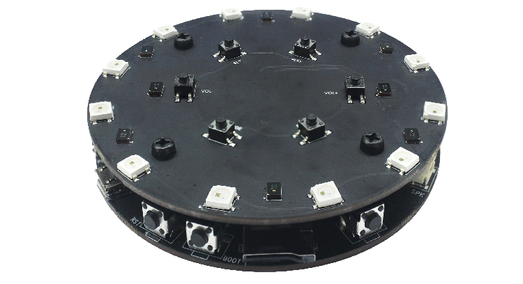

# BSP: ESP32-S3-KORVO-1

| [HW Reference](https://github.com/espressif/esp-skainet/blob/master/docs/en/hw-reference/esp32s3/user-guide-korvo-1.md) | [HOW TO USE API](API.md) | [EXAMPLES](#compatible-bsp-examples) |  |  |
| --- | --- | --- | --- | -- |

## Overview

<table>
<tr><td>

ESP32-S3-Korvo-1 is a development kit that is based on Espressif’s ESP32-S3 SoC. It features a three-microphone array which is suitable for far-field voice pick-up with low power consumption.

The ESP32-S3-Korvo-1 board consists of two parts: the main board (ESP32-S3-Korvo-1) that integrates the ESP32-S3-WROOM-1 module, function buttons, SD card slot, speaker and USB connectors; and the sub board (ESP32-Korvo-Mic, which is also used as the sub board in ESP32-Korvo v1.1) that contains a three-microphone array, function buttons, and addressable LEDs. The main board and sub board are connected via FPC cable.

</td><td width="200">
  
</td></tr>
</table>

## Capabilities and dependencies

<!-- START_DEPENDENCIES -->

|     Available    |       Capability      |Controller/Codec|                                               Component                                              |       Version       |
|------------------|-----------------------|----------------|------------------------------------------------------------------------------------------------------|---------------------|
|        :x:       |    :pager: DISPLAY    |                |                                                                                                      |                     |
|        :x:       |    :point_up: TOUCH   |                |                                                                                                      |                     |
|:heavy_check_mark:| :radio_button: BUTTONS|                |           [espressif/button](https://components.espressif.com/components/espressif/button)           |          ^4         |
|:heavy_check_mark:|  :musical_note: AUDIO |                |    [espressif/esp_codec_dev](https://components.espressif.com/components/espressif/esp_codec_dev)    |        ~1.1.0       |
|:heavy_check_mark:|:speaker: AUDIO_SPEAKER|     es8311     |                                                                                                      |                     |
|:heavy_check_mark:| :microphone: AUDIO_MIC|     es7210     |                                                                                                      |                     |
|:heavy_check_mark:|  :floppy_disk: SDCARD |                |                                                  idf                                                 |        >=4.4        |
|        :x:       |    :video_game: IMU   |                |                                                                                                      |                     |
|:heavy_check_mark:|       :bulb: LED      |                |[espressif/led_indicator](https://components.espressif.com/components/espressif/led_indicator) idf|>=0.7,<=0.8 >=4.4|

<!-- END_DEPENDENCIES -->

## Compatible BSP Examples

<!-- START_EXAMPLES -->

| Example | Description | Try with ESP Launchpad |
| ------- | ----------- | ---------------------- |
| [Audio Example](https://github.com/espressif/esp-bsp/tree/master/examples/audio) | Play and record WAV file | [Flash Example](https://espressif.github.io/esp-launchpad/?flashConfigURL=https://espressif.github.io/esp-bsp/config.toml&app=audio-) |

<!-- END_EXAMPLES -->

