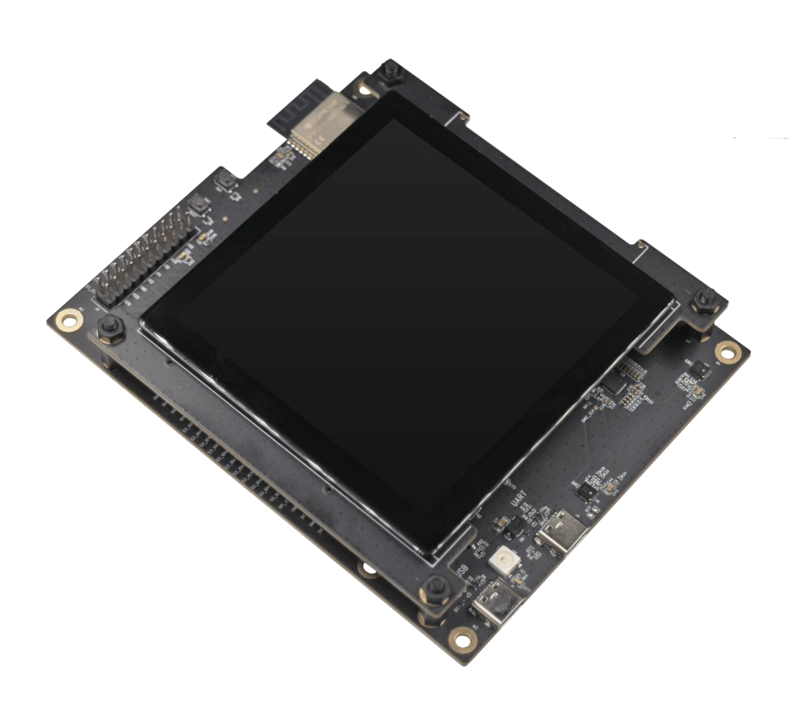

# BSP: ESP32-S3-LCD-EV-Board

| [HW Reference](https://docs.espressif.com/projects/esp-dev-kits/en/latest/esp32s3/esp32-s3-lcd-ev-board/user_guide.html) | [HOW TO USE API](API.md) | [EXAMPLES](#compatible-bsp-examples) |  |  |
| --- | --- | --- | --- | -- |

## Overview

<table>
<tr><td>

ESP32-S3-LCD-EV-Board is a development board for evaluating and verifying ESP32-S3 screen interactive applications. It has the functions of touch screen interaction and voice interaction. The development board has the following characteristics:

* Onboard ESP32-S3-WROOM-1 module, with built-in 16 MB Flash + 8/16 MB PSRAM
* Onboard audio codec + audio amplifier
* Onboard dual microphone pickup
* USB type-C interface download and debugging
* It can be used with different screen sub boards, and supports `RGB`, `8080`, `SPI`, `I2C` interface screens, as below:

</td><td width="200">
  
  
</td></tr>
</table>

|         Board Name         | Screen Size (inch) | Resolution | LCD Driver IC (Interface) | Touch Driver IC |                                                                            Schematic                                                                            | Support |
| -------------------------- | ------------------ | ---------- | ------------------------- | --------------- | --------------------------------------------------------------------------------------------------------------------------------------------------------------- | ------- |
| ESP32-S3-LCD-EV-Board-SUB1 | 0.9                | 128 x 64   | SSD1315 (I2C)             | *               | [link](https://docs.espressif.com/projects/esp-dev-kits/zh_CN/latest/_static/esp32-s3-lcd-ev-board/schematics/SCH_ESP32-S3-LCD-Ev-Board-SUB1_V1.0_20220617.pdf) | Not yet |
|                            | 2.4                | 320 x 240  | ST7789V (SPI)             | XTP2046         |                                                                                                                                                                 | Not yet |
| ESP32-S3-LCD-EV-Board-SUB2 | 3.5                | 480 x 320  | ST7796S (8080)            | GT911           | [link](https://docs.espressif.com/projects/esp-dev-kits/zh_CN/latest/_static/esp32-s3-lcd-ev-board/schematics/SCH_ESP32-S3-LCD-EV-Board-SUB2_V1.2_20230509.pdf) | Not yet |
|                            | 3.95               | 480 x 480  | GC9503CV (RGB)            | FT5x06          |                                                                                                                                                                 | Yes     |
| ESP32-S3-LCD-EV-Board-SUB3 | 4.3                | 800 x 480  | ST7262E43 (RGB)           | GT1151          | [link](https://docs.espressif.com/projects/esp-dev-kits/zh_CN/latest/_static/esp32-s3-lcd-ev-board/schematics/SCH_ESP32-S3-LCD-EV-Board-SUB3_V1.1_20230315.pdf) | Yes     |

Here are some useful configurations in menuconfig that can be customed by user:

* `BSP_LCD_RGB_BUFFER_NUMS`: Configure the number of frame buffers. The anti-tearing function can be activated only when set to a value greater than one.
* `BSP_LCD_RGB_REFRESH_MODE`: Choose the refresh mode for the RGB LCD.
    * `BSP_LCD_RGB_REFRESH_AUTO`: Use the most common method to refresh the LCD.
    * `BSP_LCD_RGB_BOUNCE_BUFFER_MODE`: Enabling bounce buffer mode can lead to a higher PCLK frequency at the expense of increased CPU consumption. **This mode is particularly useful when dealing with [screen drift](https://docs.espressif.com/projects/esp-faq/en/latest/software-framework/peripherals/lcd.html#why-do-i-get-drift-overall-drift-of-the-display-when-esp32-s3-is-driving-an-rgb-lcd-screen), especially in scenarios involving Wi-Fi usage or writing to Flash memory.** This feature should be used in conjunction with `ESP32S3_DATA_CACHE_LINE_64B` configuration. For more detailed information, refer to the [documentation](https://docs.espressif.com/projects/esp-idf/en/latest/esp32s3/api-reference/peripherals/lcd.html#bounce-buffer-with-single-psram-frame-buffer).
* `BSP_DISPLAY_LVGL_BUF_CAPS`: Select the memory type for the LVGL buffer. Internal memory offers better performance.
* `BSP_DISPLAY_LVGL_BUF_HEIGHT`: Set the height of the LVGL buffer, with its width aligning with the LCD's width. The default value is 100, decreasing it can lower memory consumption.
* `BSP_DISPLAY_LVGL_AVOID_TEAR`: Avoid tearing effect by using multiple buffers. This requires setting `BSP_LCD_RGB_BUFFER_NUMS` to a value greater than 1.
    * `BSP_DISPLAY_LVGL_MODE`:
        * `BSP_DISPLAY_LVGL_FULL_REFRESH`: Use LVGL full-refresh mode. Set `BSP_LCD_RGB_BUFFER_NUMS` to `3` will get higher FPS`.
        * `BSP_DISPLAY_LVGL_DIRECT_MODE`: Use LVGL's direct mode.

Based on the above configurations, there are three different anti-tearing modes can be used:

* RGB double-buffer + LVGL full-refresh mode:
    * Set `BSP_LCD_RGB_BUFFER_NUMS` to `2`
    * Enable `BSP_DISPLAY_LVGL_AVOID_TEAR` and `BSP_DISPLAY_LVGL_FULL_REFRESH`
* RGB double-buffer + LVGL direct-mode:
    * Set `BSP_LCD_RGB_BUFFER_NUMS` to `2`
    * Enable `BSP_DISPLAY_LVGL_AVOID_TEAR` and `BSP_DISPLAY_LVGL_DIRECT_MODE`
* RGB triple-buffer + LVGL full-refresh mode:
    * Set `BSP_LCD_RGB_BUFFER_NUMS` to `3`
    * Enable `BSP_DISPLAY_LVGL_AVOID_TEAR` and `BSP_DISPLAY_LVGL_FULL_REFRESH`

## Capabilities and dependencies

<!-- START_DEPENDENCIES -->

|     Available    |       Capability       |Controller/Codec|                                                                                                              Component                                                                                                              |      Version      |
|------------------|------------------------|----------------|-------------------------------------------------------------------------------------------------------------------------------------------------------------------------------------------------------------------------------------|-------------------|
|:heavy_check_mark:|     :pager: DISPLAY    |                |[espressif/esp_lcd_gc9503](https://components.espressif.com/components/espressif/esp_lcd_gc9503) [espressif/esp_lcd_panel_io_additions](https://components.espressif.com/components/espressif/esp_lcd_panel_io_additions) idf|^3 ^1 >=5.3|
|:heavy_check_mark:|:black_circle: LVGL_PORT|                |                                                                    [espressif/esp_lvgl_port](https://components.espressif.com/components/espressif/esp_lvgl_port)                                                                   |         ^2        |
|:heavy_check_mark:|    :point_up: TOUCH    |                |    [espressif/esp_lcd_touch_ft5x06](https://components.espressif.com/components/espressif/esp_lcd_touch_ft5x06) [espressif/esp_lcd_touch_gt1151](https://components.espressif.com/components/espressif/esp_lcd_touch_gt1151)    |     ^1 ^1     |
|:heavy_check_mark:| :radio_button: BUTTONS |                |                                                                           [espressif/button](https://components.espressif.com/components/espressif/button)                                                                          |         ^4        |
|:heavy_check_mark:|  :musical_note: AUDIO  |                |                                                                    [espressif/esp_codec_dev](https://components.espressif.com/components/espressif/esp_codec_dev)                                                                   |       ~1.3.1      |
|:heavy_check_mark:| :speaker: AUDIO_SPEAKER|     es8311     |                                                                                                                                                                                                                                     |                   |
|:heavy_check_mark:| :microphone: AUDIO_MIC |     es7210     |                                                                                                                                                                                                                                     |                   |
|        :x:       |  :floppy_disk: SDCARD  |                |                                                                                                                                                                                                                                     |                   |
|        :x:       |    :video_game: IMU    |                |                                                                                                                                                                                                                                     |                   |

<!-- END_DEPENDENCIES -->

## Compatible BSP Examples

<!-- START_EXAMPLES -->

| Example | Description | Try with ESP Launchpad |
| ------- | ----------- | ---------------------- |
| [Display Example](https://github.com/espressif/esp-bsp/tree/master/examples/display) | Show an image on the screen with a simple startup animation (LVGL) | [Flash Example](https://espressif.github.io/esp-launchpad/?flashConfigURL=https://espressif.github.io/esp-bsp/config.toml&app=display-) |
| [Display, Audio and Photo Example](https://github.com/espressif/esp-bsp/tree/master/examples/display_audio_photo) | Complex demo: browse files from filesystem and play/display JPEG, WAV, or TXT files (LVGL) | [Flash Example](https://espressif.github.io/esp-launchpad/?flashConfigURL=https://espressif.github.io/esp-bsp/config.toml&app=display_audio_photo-) |
| [LVGL Benchmark Example](https://github.com/espressif/esp-bsp/tree/master/examples/display_lvgl_benchmark) | Run LVGL benchmark tests | - |
| [LVGL Demos Example](https://github.com/espressif/esp-bsp/tree/master/examples/display_lvgl_demos) | Run the LVGL demo player - all LVGL examples are included (LVGL) | [Flash Example](https://espressif.github.io/esp-launchpad/?flashConfigURL=https://espressif.github.io/esp-bsp/config.toml&app=display_lvgl_demos-) |
| [Display Rotation Example](https://github.com/espressif/esp-bsp/tree/master/examples/display_rotation) | Rotate screen using buttons or an accelerometer (`BSP_CAPS_IMU`, if available) | [Flash Example](https://espressif.github.io/esp-launchpad/?flashConfigURL=https://espressif.github.io/esp-bsp/config.toml&app=display_rotation-) |

<!-- END_EXAMPLES -->

<!-- START_BENCHMARK -->

## LVGL Benchmark

**DATE:** 11.08.2025 02:49

**LVGL version:** 9.3.0

| Name | Avg. CPU | Avg. FPS | Avg. time | render time | flush time |
| ---- | :------: | :------: | :-------: | :---------: | :--------: |
| Empty screen | 98%  | 18  | 51  | 30  | 21  |
| Moving wallpaper | 99%  | 8  | 106  | 83  | 23  |
| Single rectangle | 99%  | 34  | 25  | 2  | 23  |
| Multiple rectangles | 99%  | 32  | 27  | 18  | 9  |
| Multiple RGB images | 99%  | 28  | 31  | 24  | 7  |
| Multiple ARGB images | 100%  | 17  | 51  | 35  | 16  |
| Rotated ARGB images | 100%  | 14  | 62  | 52  | 10  |
| Multiple labels | 99%  | 18  | 45  | 34  | 11  |
| Screen sized text | 100%  | 8  | 108  | 92  | 16  |
| Multiple arcs | 99%  | 35  | 22  | 7  | 15  |
| Containers | 99%  | 16  | 53  | 42  | 11  |
| Containers with overlay | 99%  | 9  | 89  | 77  | 12  |
| Containers with opa | 99%  | 11  | 73  | 58  | 15  |
| Containers with opa_layer | 99%  | 5  | 148  | 135  | 13  |
| Containers with scrolling | 99%  | 11  | 81  | 63  | 18  |
| Widgets demo | 99%  | 7  | 100  | 87  | 13  |
| All scenes avg. | 99%  | 16  | 66  | 52  | 14  |

<!-- END_BENCHMARK -->