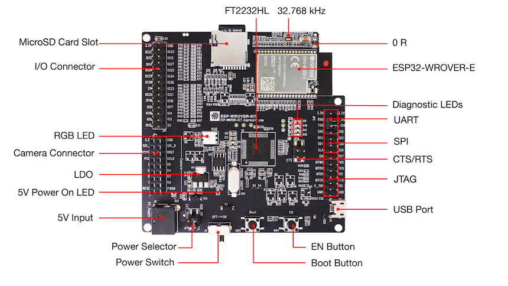

# BSP: ESP-WROVER-KIT

| [HW Reference](https://www.espressif.com/en/products/hardware/esp-wrover-kit/overview) | [HOW TO USE API](API.md) | [EXAMPLES](#compatible-bsp-examples) |  |  |
| --- | --- | --- | --- | -- |

## Overview

<table>
<tr><td>

ESP-WROVER-KIT is an ESP32-based development board produced by Espressif. This board features an integrated LCD screen and microSD card slot.

**ESP-WROVER-KIT features the following integrated components:**
* ESP32-WROVER-E module
* LCD screen
* microSD card slot
* RGB LED

</td><td width="200">
  
</td></tr>
</table>

Its another distinguishing feature is the embedded FTDI FT2232HL chip - an advanced multi-interface USB bridge. This chip enables to use JTAG for direct debugging of ESP32 through the USB interface without a separate JTAG debugger. ESP-WROVER-KIT makes development convenient, easy, and cost-effective.

Most of the ESP32 I/O pins are broken out to the board’s pin headers for easy access.

## Capabilities and dependencies

<!-- START_DEPENDENCIES -->

|     Available    |       Capability       |Controller/Codec|                                           Component                                          |Version|
|------------------|------------------------|----------------|----------------------------------------------------------------------------------------------|-------|
|:heavy_check_mark:|     :pager: DISPLAY    |     st7789     |                                              idf                                             |>=4.4.5|
|:heavy_check_mark:|:black_circle: LVGL_PORT|                |[espressif/esp_lvgl_port](https://components.espressif.com/components/espressif/esp_lvgl_port)|   ^2  |
|        :x:       |    :point_up: TOUCH    |                |                                                                                              |       |
|:heavy_check_mark:| :radio_button: BUTTONS |                |       [espressif/button](https://components.espressif.com/components/espressif/button)       |   ^4  |
|        :x:       |  :musical_note: AUDIO  |                |                                                                                              |       |
|        :x:       | :speaker: AUDIO_SPEAKER|                |                                                                                              |       |
|        :x:       | :microphone: AUDIO_MIC |                |                                                                                              |       |
|:heavy_check_mark:|       :bulb: LED       |                |                                              idf                                             |>=4.4.5|
|:heavy_check_mark:|  :floppy_disk: SDCARD  |                |                                              idf                                             |>=4.4.5|
|        :x:       |    :video_game: IMU    |                |                                                                                              |       |
|        :x:       |     :camera: CAMERA    |                |                                                                                              |       |

<!-- END_DEPENDENCIES -->

## Compatible BSP Examples

<!-- START_EXAMPLES -->

| Example | Description | Try with ESP Launchpad |
| ------- | ----------- | ---------------------- |
| [Display Example](https://github.com/espressif/esp-bsp/tree/master/examples/display) | Show an image on the screen with a simple startup animation (LVGL) | [Flash Example](https://espressif.github.io/esp-launchpad/?flashConfigURL=https://espressif.github.io/esp-bsp/config.toml&app=display-) |

<!-- END_EXAMPLES -->

<!-- START_BENCHMARK -->
<!-- END_BENCHMARK -->
