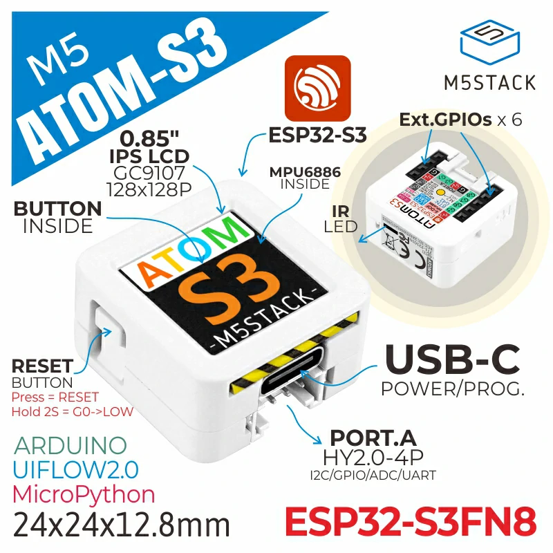

# BSP: M5 Atom S3

| [HW Reference](https://docs.m5stack.com/en/core/AtomS3) | [HOW TO USE API](API.md) | [EXAMPLES](#compatible-bsp-examples) |  |  |
| --- | --- | --- | --- | -- |

## Overview

<table>
<tr><td>

AtomS3 is a highly integrated programmable controller that harnesses the power of the ESP32-S3 chip. This compact controller boasts a range of features, including integrated WiFi functionality and 8MB of on-chip FLASH memory. With the ESP32-S3 chip, AtomS3 delivers exceptional performance and versatility for a variety of applications.

AtomS3 features a sleek 0.85-inch IPS screen, providing clear visual feedback and user interaction. The bottom of the screen is equipped with programmable buttons, allowing for customizable functions and enhanced user control. It comes with a built-in 5V to 3.3V circuit, ensuring stable power supply for reliable operation. The controller incorporates a 6-axis gyro sensor MPU6886, enabling precise motion detection and orientation tracking. On-board Type-C interface facilitates both power supply and firmware download processes. Additionally, AtomS3 offers one HY2.0-4P expansion port, six GPIOs, and power pins reserved at the bottom for seamless integration and expansion of various applications.

AtomS3 is designed with compactness in mind, measuring at only 24 *24 *13mm in size. Its small form factor makes it suitable for a wide range of embedded smart device applications. Whether it's robotics, IoT devices, or other embedded systems, AtomS3 provides a powerful and flexible solution to meet the project requirements.

</td><td width="200" valign="top">
  
</td></tr>
</table>

## Capabilities and dependencies

<!-- START_DEPENDENCIES -->

|     Available    |       Capability       |Controller/Codec|                                                Component                                               |     Version    |
|------------------|------------------------|----------------|--------------------------------------------------------------------------------------------------------|----------------|
|:heavy_check_mark:|     :pager: DISPLAY    |     gc9a01     |[espressif/esp_lcd_gc9a01](https://components.espressif.com/components/espressif/esp_lcd_gc9a01) idf|^2.0.3 >=5.2|
|:heavy_check_mark:|:black_circle: LVGL_PORT|                |     [espressif/esp_lvgl_port](https://components.espressif.com/components/espressif/esp_lvgl_port)     |       ^2       |
|        :x:       |    :point_up: TOUCH    |                |                                                                                                        |                |
|:heavy_check_mark:| :radio_button: BUTTONS |                |            [espressif/button](https://components.espressif.com/components/espressif/button)            |    >=4,<5.0    |
|        :x:       |   :white_circle: KNOB  |                |                                                                                                        |                |
|        :x:       |  :musical_note: AUDIO  |                |                                                                                                        |                |
|        :x:       | :speaker: AUDIO_SPEAKER|                |                                                                                                        |                |
|        :x:       | :microphone: AUDIO_MIC |                |                                                                                                        |                |
|        :x:       |  :floppy_disk: SDCARD  |                |                                                                                                        |                |
|        :x:       |    :video_game: IMU    |                |                                                                                                        |                |

<!-- END_DEPENDENCIES -->

## Compatible BSP Examples

<!-- START_EXAMPLES -->

| Example | Description | Try with ESP Launchpad |
| ------- | ----------- | ---------------------- |
| [Display Example](https://github.com/espressif/esp-bsp/tree/master/examples/display) | Show an image on the screen with a simple startup animation (LVGL) | [Flash Example](https://espressif.github.io/esp-launchpad/?flashConfigURL=https://espressif.github.io/esp-bsp/config.toml&app=display-) |

<!-- END_EXAMPLES -->

<!-- START_BENCHMARK -->
<!-- END_BENCHMARK -->
