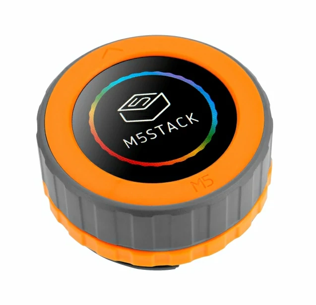

# BSP: M5SDial

| [HW Reference](https://docs.m5stack.com/en/core/M5Dial) | [HOW TO USE API](API.md) | [EXAMPLES](#compatible-bsp-examples) |  |  |
| --- | --- | --- | --- | -- |

## Overview

<table>
<tr><td>

As a versatile embedded development board, M5Dial integrates the necessary features and sensors for various smart home control applications. It features a 1.28-inch round TFT touchscreen, a rotary encoder, an RFID detection module, an RTC circuit, a buzzer, and under-screen buttons, enabling users to easily implement a wide range of creative projects.

The main controller of M5Dial is M5StampS3, a micro module based on the ESP32-S3 chip known for its high performance and low power consumption. It supports Wi-Fi, as well as various peripheral interfaces such as SPI, I2C, UART, ADC, and more. M5StampS3 also comes with 8MB of built-in Flash, providing sufficient storage space for users.

</td><td width="200" valign="top">
  
</td></tr>
<tr><td colspan="2">
The standout feature of M5Dial is its rotary encoder, which accurately records the position and direction of the knob, delivering a better interactive experience. Users can adjust settings such as volume, brightness, and menu options using the knob, or control home applications like lights, air conditioning, and curtains. The device's built-in display screen allows for displaying different interaction colors and effects.

With its compact size and lightweight design, M5Dial is suitable for various embedded applications. Whether it's controlling home devices in the smart home domain or monitoring and controlling systems in industrial automation, M5Dial can be easily integrated to provide intelligent control and interaction capabilities.

M5Dial also features RFID detection, enabling the recognition of RFID cards and tags operating at 13.56MHz. Users can utilize this function for applications such as access control, identity verification, and payments.Furthermore, M5Dial is equipped with an RTC circuit to maintain accurate time and date. Additionally, it includes an onboard buzzer and a physical button for device sound prompts and wake-up operations.

M5Dial provides versatile power supply options to cater to various needs. It accommodates a wide range of input voltages, accepting 6-36V DC input. Additionally, it features a battery port with a built-in charging circuit, enabling seamless connection to external Lithium batteries. This adaptability allows users to power M5Dial via USB-C, the DC interface, or an external battery for on-the-go convenience. M5Dial also reserves two PORTA and PORTB interfaces, supporting the expansion of I2C and GPIO devices. Users can connect various sensors, actuators, displays, and other peripherals through these interfaces, adding more functionality and possibilities.
</td></tr>
</table>

## Capabilities and dependencies

<!-- START_DEPENDENCIES -->

|     Available    |       Capability       |Controller/Codec|                                                  Component                                                 |     Version    |
|------------------|------------------------|----------------|------------------------------------------------------------------------------------------------------------|----------------|
|:heavy_check_mark:|     :pager: DISPLAY    |     gc9a01     |  [espressif/esp_lcd_gc9a01](https://components.espressif.com/components/espressif/esp_lcd_gc9a01) idf  |^2.0.3 >=5.0|
|:heavy_check_mark:|:black_circle: LVGL_PORT|                |       [espressif/esp_lvgl_port](https://components.espressif.com/components/espressif/esp_lvgl_port)       |       ^2       |
|:heavy_check_mark:|    :point_up: TOUCH    |     ft5x06     |[espressif/esp_lcd_touch_ft5x06](https://components.espressif.com/components/espressif/esp_lcd_touch_ft5x06)|       ^1       |
|:heavy_check_mark:| :radio_button: BUTTONS |                |              [espressif/button](https://components.espressif.com/components/espressif/button)              |       ^4       |
|:heavy_check_mark:|   :white_circle: KNOB  |                |                [espressif/knob](https://components.espressif.com/components/espressif/knob)                |     ^0.1.3     |
|        :x:       |  :musical_note: AUDIO  |                |                                                                                                            |                |
|        :x:       | :speaker: AUDIO_SPEAKER|                |                                                                                                            |                |
|        :x:       | :microphone: AUDIO_MIC |                |                                                                                                            |                |
|        :x:       |  :floppy_disk: SDCARD  |                |                                                                                                            |                |
|        :x:       |    :video_game: IMU    |                |                                                                                                            |                |

<!-- END_DEPENDENCIES -->

## Compatible BSP Examples

<!-- START_EXAMPLES -->

| Example | Description | Try with ESP Launchpad |
| ------- | ----------- | ---------------------- |
| [Display Example](https://github.com/espressif/esp-bsp/tree/master/examples/display) | Show an image on the screen with a simple startup animation (LVGL) | [Flash Example](https://espressif.github.io/esp-launchpad/?flashConfigURL=https://espressif.github.io/esp-bsp/config.toml&app=display-) |
| [LVGL Benchmark Example](https://github.com/espressif/esp-bsp/tree/master/examples/display_lvgl_benchmark) | Run LVGL benchmark tests | - |
| [LVGL Demos Example](https://github.com/espressif/esp-bsp/tree/master/examples/display_lvgl_demos) | Run the LVGL demo player - all LVGL examples are included (LVGL) | [Flash Example](https://espressif.github.io/esp-launchpad/?flashConfigURL=https://espressif.github.io/esp-bsp/config.toml&app=display_lvgl_demos-) |
| [Display Rotation Example](https://github.com/espressif/esp-bsp/tree/master/examples/display_rotation) | Rotate screen using buttons or an accelerometer (`BSP_CAPS_IMU`, if available) | [Flash Example](https://espressif.github.io/esp-launchpad/?flashConfigURL=https://espressif.github.io/esp-bsp/config.toml&app=display_rotation-) |

<!-- END_EXAMPLES -->

<!-- START_BENCHMARK -->

## LVGL Benchmark

**DATE:** 19.08.2025 02:45

**LVGL version:** 9.3.0

| Name | Avg. CPU | Avg. FPS | Avg. time | render time | flush time |
| ---- | :------: | :------: | :-------: | :---------: | :--------: |
| Empty screen | 96%  | 38  | 22  | 6  | 16  |
| Moving wallpaper | 95%  | 41  | 23  | 12  | 11  |
| Single rectangle | 33%  | 98  | 2  | 0  | 2  |
| Multiple rectangles | 90%  | 63  | 12  | 8  | 4  |
| Multiple RGB images | 33%  | 92  | 1  | 1  | 0  |
| Multiple ARGB images | 35%  | 92  | 3  | 3  | 0  |
| Rotated ARGB images | 80%  | 62  | 15  | 15  | 0  |
| Multiple labels | 65%  | 93  | 4  | 4  | 0  |
| Screen sized text | 97%  | 24  | 39  | 38  | 1  |
| Multiple arcs | 25%  | 87  | 1  | 1  | 0  |
| Containers | 39%  | 83  | 13  | 10  | 3  |
| Containers with overlay | 94%  | 33  | 26  | 21  | 5  |
| Containers with opa | 46%  | 78  | 15  | 12  | 3  |
| Containers with opa_layer | 50%  | 72  | 19  | 16  | 3  |
| Containers with scrolling | 96%  | 32  | 27  | 21  | 6  |
| Widgets demo | 99%  | 27  | 19  | 18  | 1  |
| All scenes avg. | 67%  | 63  | 14  | 11  | 3  |

<!-- END_BENCHMARK -->
