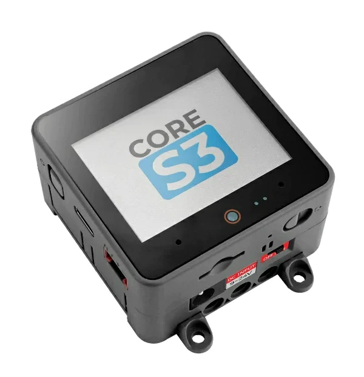

# BSP: M5Stack CoreS3

| [HW Reference](https://docs.m5stack.com/en/core/CoreS3) | [HOW TO USE API](API.md) | [EXAMPLES](#compatible-bsp-examples) |  |  |
| --- | --- | --- | --- | -- |
> [!WARNING]
> The SD card is not working simultaneously with the LCD screen. We are working on a fix.

## Overview

<table>
<tr><td>

CoreS3 is the third generation of the M5Stack Core series. Powered by the ESP32-S3 solution, this kit features a dual-core Xtensa LX7 processor running at 240MHz. CoreS3 comes equipped with built-in Wi-Fi functionality, enabling seamless connectivity. It boasts 16MB of onboard flash memory and 8MB of PSRAM, providing ample space for program storage.

CoreS3 offers convenient programming options through its TYPE-C interface, supporting OTG and CDC functions. This allows for easy connection with external USB devices and hassle-free firmware flashing. CoreS3 features a 2.0-inch capacitive touch IPS screen, protected by high-strength glass material. Additionally, a 0.3 megapixel camera GC0308 is integrated at the bottom of the screen, accompanied by a proximity sensor LTR-553ALS-WA for enhanced functionality. Power management is handled by the AXP2101 power management core chip, employing a 4-way power flow control loop for efficient power distribution. The overall design emphasizes low power consumption. CoreS3 also features a 6-axis attitude sensor BMI270 and a magnetometer BMM150 for precise motion detection. With the onboard TF-card (microSD) card slot and BM8563 RTC chip, accurate timing and sleep-timer wake-up functions are readily available.

</td><td width="200" valign="top">
  
</td></tr>
<tr><td colspan="2">

Sound output on CoreS3 is optimized with the high-fidelity 16-bit I2S power amplifier chip AW88298, accompanied by a built-in 1W speaker for clear audio playback. For sound input, the kit incorporates the ES7210 audio decoding chip and dual-microphone input. The side of the device includes an independent power button and restart (RST) button, complemented by a self-built delay circuit. By long-pressing the reset button, users can easily enter the program download mode. The CoreS3 kit comes with the DinBase Base, providing convenient options for Din rail, wall, and screw fixing. It can be powered by an external DC 12V (supports 9~24V) or an internal 500mAh lithium battery. The DinBase also offers multiple proto locations for users to customize and expand their projects. CoreS3 is an ideal choice for IoT development, various DIY project development, smart home control systems, and industrial automation control systems.
</td></tr>
</table>

## Capabilities and dependencies

<!-- START_DEPENDENCIES -->

|     Available    |       Capability       |Controller/Codec|                                                  Component                                                 |   Version  |
|------------------|------------------------|----------------|------------------------------------------------------------------------------------------------------------|------------|
|:heavy_check_mark:|     :pager: DISPLAY    |     ili9341    | [espressif/esp_lcd_ili9341](https://components.espressif.com/components/espressif/esp_lcd_ili9341) idf |^1 >=5.4|
|:heavy_check_mark:|:black_circle: LVGL_PORT|                |       [espressif/esp_lvgl_port](https://components.espressif.com/components/espressif/esp_lvgl_port)       |     ^2     |
|:heavy_check_mark:|    :point_up: TOUCH    |     ft5x06     |[espressif/esp_lcd_touch_ft5x06](https://components.espressif.com/components/espressif/esp_lcd_touch_ft5x06)|     ^1     |
|        :x:       | :radio_button: BUTTONS |                |                                                                                                            |            |
|:heavy_check_mark:|  :musical_note: AUDIO  |                |       [espressif/esp_codec_dev](https://components.espressif.com/components/espressif/esp_codec_dev)       |   ~1.3.1   |
|:heavy_check_mark:| :speaker: AUDIO_SPEAKER|     aw88298    |                                                                                                            |            |
|:heavy_check_mark:| :microphone: AUDIO_MIC |     es7210     |                                                                                                            |            |
|:heavy_check_mark:|  :floppy_disk: SDCARD  |                |                                                     idf                                                    |    >=5.4   |
|        :x:       |    :video_game: IMU    |                |                                                                                                            |            |
|:heavy_check_mark:|     :camera: CAMERA    |                |        [espressif/esp32-camera](https://components.espressif.com/components/espressif/esp32-camera)        |   ^2.0.11  |

<!-- END_DEPENDENCIES -->

## Compatible BSP Examples

<!-- START_EXAMPLES -->

| Example | Description | Try with ESP Launchpad |
| ------- | ----------- | ---------------------- |
| [Display Example](https://github.com/espressif/esp-bsp/tree/master/examples/display) | Show an image on the screen with a simple startup animation (LVGL) | [Flash Example](https://espressif.github.io/esp-launchpad/?flashConfigURL=https://espressif.github.io/esp-bsp/config.toml&app=display) |
| [Display, Audio and Photo Example](https://github.com/espressif/esp-bsp/tree/master/examples/display_audio_photo) | Complex demo: browse files from filesystem and play/display JPEG, WAV, or TXT files (LVGL) | [Flash Example](https://espressif.github.io/esp-launchpad/?flashConfigURL=https://espressif.github.io/esp-bsp/config.toml&app=display_audio_photo) |
| [Camera Example](https://github.com/espressif/esp-bsp/tree/master/examples/display_camera) | Stream camera output to display (LVGL) | [Flash Example](https://espressif.github.io/esp-launchpad/?flashConfigURL=https://espressif.github.io/esp-bsp/config.toml&app=display_camera) |
| [LVGL Benchmark Example](https://github.com/espressif/esp-bsp/tree/master/examples/display_lvgl_benchmark) | Run LVGL benchmark tests | - |
| [LVGL Demos Example](https://github.com/espressif/esp-bsp/tree/master/examples/display_lvgl_demos) | Run the LVGL demo player - all LVGL examples are included (LVGL) | [Flash Example](https://espressif.github.io/esp-launchpad/?flashConfigURL=https://espressif.github.io/esp-bsp/config.toml&app=display_lvgl_demo) |
| [Display Rotation Example](https://github.com/espressif/esp-bsp/tree/master/examples/display_rotation) | Rotate screen using buttons or an accelerometer (`BSP_CAPS_IMU`, if available) | [Flash Example](https://espressif.github.io/esp-launchpad/?flashConfigURL=https://espressif.github.io/esp-bsp/config.toml&app=display_rotation) |

<!-- END_EXAMPLES -->

<!-- START_BENCHMARK -->

## LVGL Benchmark

**DATE:** 11.06.2025 02:41

**LVGL version:** 9.3.0

| Name | Avg. CPU | Avg. FPS | Avg. time | render time | flush time |
| ---- | :------: | :------: | :-------: | :---------: | :--------: |
| Empty screen | 93%  | 29  | 30  | 5  | 25  |
| Moving wallpaper | 94%  | 30  | 31  | 11  | 20  |
| Single rectangle | 21%  | 92  | 0  | 0  | 0  |
| Multiple rectangles | 86%  | 55  | 13  | 8  | 5  |
| Multiple RGB images | 27%  | 90  | 1  | 1  | 0  |
| Multiple ARGB images | 25%  | 89  | 4  | 4  | 0  |
| Rotated ARGB images | 78%  | 51  | 18  | 14  | 4  |
| Multiple labels | 82%  | 80  | 9  | 7  | 2  |
| Screen sized text | 96%  | 22  | 41  | 39  | 2  |
| Multiple arcs | 21%  | 91  | 0  | 0  | 0  |
| Containers | 36%  | 72  | 16  | 8  | 8  |
| Containers with overlay | 87%  | 28  | 30  | 21  | 9  |
| Containers with opa | 41%  | 73  | 16  | 10  | 6  |
| Containers with opa_layer | 61%  | 56  | 26  | 20  | 6  |
| Containers with scrolling | 93%  | 27  | 33  | 20  | 13  |
| Widgets demo | 95%  | 27  | 20  | 17  | 3  |
| All scenes avg. | 64%  | 57  | 17  | 11  | 6  |

<!-- END_BENCHMARK -->
