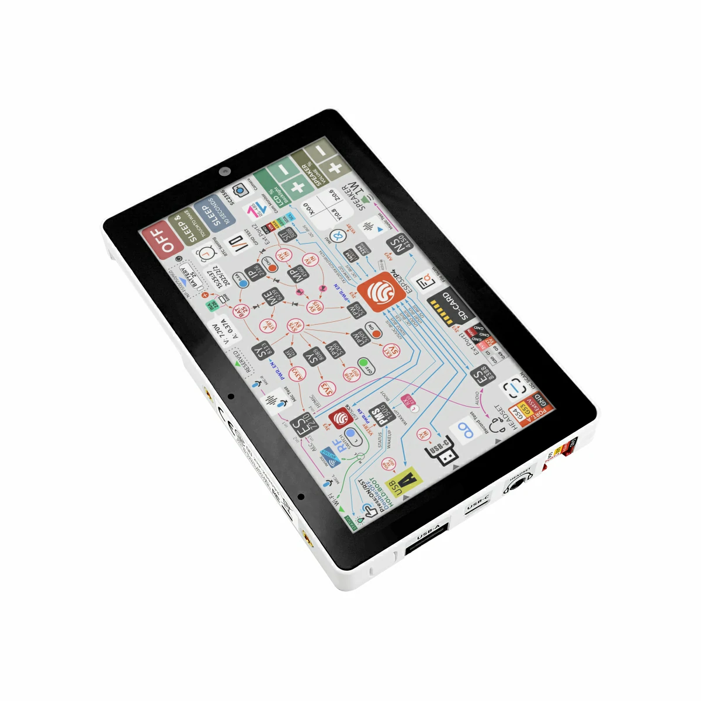

# BSP: m5stack_tab5

| [HW Reference](https://docs.m5stack.com/en/core/Tab5) | [HOW TO USE API](API.md) | [EXAMPLES](#compatible-bsp-examples) |  |  |
| --- | --- | --- | --- | -- |

## Overview

<table>
<tr><td>

**Tab5** is a highly extensible, portable smart IoT terminal development device designed for developers, integrating a dual-chip architecture and abundant hardware resources. Its main controller adopts the RISC‑V–based **ESP32‑P4** SoC, equipped with 16 MB Flash and 32 MB PSRAM; the wireless module uses the ESP32‑C6‑MINI‑1U, supporting Wi‑Fi 6. Its antenna system can freely switch between the built-in 3D antenna and the external MMCX antenna interface, flexibly adapting to different deployment environments to ensure data throughput and low-latency control.

In terms of vision and interaction, Tab5 features a 5″ 1280×720 IPS **TFT** display via a MIPI‑DSI interface, with touch handled by the GT911 multi-point **touch** controller (I2C) for a smooth and responsive touch experience; it also includes an SC2356 2 MP **camera** (1600×1200) via a MIPI‑CSI interface, capable of high-definition video recording, image processing, and edge AI applications (e.g., face recognition, object tracking).

For peripheral interfaces, Tab5 offers **USB‑A** (Host) and **USB‑C** (USB 2.0 OTG) ports for connecting traditional peripherals like a mouse or keyboard; industrial scenarios can use **RS‑485** (SIT3088 + DIP switch–selectable 120 Ω termination) bus communication. Grove, M5BUS, GPIO_EXT header, and **Micro SD** card slot, as well as reserved STAMP pads (supporting Cat.M, NB‑IoT, LoRaWAN, etc.), allow flexible expansion with various sensors and communication modules. It also includes Reset/Boot buttons for quick reset and entering firmware download mode.

</td><td width="200" valign="top">
  
</td></tr>
<tr><td colspan="2">

In audio/video, Tab5 uses the ES8388 **audio codec**, paired with the ES7210 AEC echo-cancellation front end, a **dual-microphone** array, a 3.5 mm headphone jack, and a speaker for high-fidelity recording/playback and accurate voice recognition. The built-in BMI270 **6-axis sensor** (accelerometer + gyroscope, with interrupt wakeup) can trigger the main controller in motion-tracking and posture-detection scenarios, improving responsiveness in low-power conditions.

For time and power management, Tab5 integrates the RX8130CE **real-time clock** (with timed interrupt wakeup), supports a removable NP‑F550 **lithium battery**, and includes MP4560 boost/buck management, IP2326 charge/discharge control, and INA226 real-time **monitoring** circuitry—ensuring stable operation without external power.

Structurally, Tab5 features a standard 1/4″‑20 tripod mount on the side, allowing direct attachment to tripods or other mounts for easy shooting and deployment.

Tab5 is suitable for smart home control, remote monitoring, industrial automation, IoT prototyping, education, and research—providing developers and enterprises a comprehensive, easily expandable, high-performance development platform.</td></tr>
</table>

## Capabilities and dependencies

<!-- START_DEPENDENCIES -->

|     Available    |       Capability       |Controller/Codec|                                                  Component                                                 |  Version  |
|------------------|------------------------|----------------|------------------------------------------------------------------------------------------------------------|-----------|
|:heavy_check_mark:|     :pager: DISPLAY    |    ili9881c    |idf [espressif/esp_lcd_ili9881c](https://components.espressif.com/components/espressif/esp_lcd_ili9881c)|>=5.4 *|
|:heavy_check_mark:|:black_circle: LVGL_PORT|                |       [espressif/esp_lvgl_port](https://components.espressif.com/components/espressif/esp_lvgl_port)       |     ^2    |
|:heavy_check_mark:|    :point_up: TOUCH    |      gt911     | [espressif/esp_lcd_touch_gt911](https://components.espressif.com/components/espressif/esp_lcd_touch_gt911) |     *     |
|        :x:       | :radio_button: BUTTONS |                |                                                                                                            |           |
|        :x:       |   :white_circle: KNOB  |                |                                                                                                            |           |
|:heavy_check_mark:|  :musical_note: AUDIO  |                |       [espressif/esp_codec_dev](https://components.espressif.com/components/espressif/esp_codec_dev)       |    ~1.5   |
|:heavy_check_mark:| :speaker: AUDIO_SPEAKER|     es8388     |                                                                                                            |           |
|:heavy_check_mark:| :microphone: AUDIO_MIC |     es7210     |                                                                                                            |           |
|:heavy_check_mark:|  :floppy_disk: SDCARD  |                |                                                     idf                                                    |   >=5.4   |
|        :x:       |       :bulb: LED       |                |                                                                                                            |           |
|:heavy_check_mark:|     :camera: CAMERA    |     SC202CS    |           [espressif/esp_video](https://components.espressif.com/components/espressif/esp_video)           |    ~1.4   |
|        :x:       |      :battery: BAT     |                |                                                                                                            |           |
|        :x:       |    :video_game: IMU    |                |                                                                                                            |           |

<!-- END_DEPENDENCIES -->

## Compatible BSP Examples

<!-- START_EXAMPLES -->

| Example | Description | Try with ESP Launchpad |
| ------- | ----------- | ---------------------- |
| [Display Example](https://github.com/espressif/esp-bsp/tree/master/examples/display) | Show an image on the screen with a simple startup animation (LVGL) | [Flash Example](https://espressif.github.io/esp-launchpad/?flashConfigURL=https://espressif.github.io/esp-bsp/config.toml&app=display-) |
| [Display, Audio and Photo Example](https://github.com/espressif/esp-bsp/tree/master/examples/display_audio_photo) | Complex demo: browse files from filesystem and play/display JPEG, WAV, or TXT files (LVGL) | [Flash Example](https://espressif.github.io/esp-launchpad/?flashConfigURL=https://espressif.github.io/esp-bsp/config.toml&app=display_audio_photo-) |
| [Camera Example](https://github.com/espressif/esp-bsp/tree/master/examples/display_camera_video) | Stream camera output to display (LVGL) | [Flash Example](https://espressif.github.io/esp-launchpad/?flashConfigURL=https://espressif.github.io/esp-bsp/config.toml&app=display_camera_video) |
| [LVGL Demos Example](https://github.com/espressif/esp-bsp/tree/master/examples/display_lvgl_demos) | Run the LVGL demo player - all LVGL examples are included (LVGL) | [Flash Example](https://espressif.github.io/esp-launchpad/?flashConfigURL=https://espressif.github.io/esp-bsp/config.toml&app=display_lvgl_demos-) |
| [Display Rotation Example](https://github.com/espressif/esp-bsp/tree/master/examples/display_rotation) | Rotate screen using buttons or an accelerometer (`BSP_CAPS_IMU`, if available) | [Flash Example](https://espressif.github.io/esp-launchpad/?flashConfigURL=https://espressif.github.io/esp-bsp/config.toml&app=display_rotation-) |
| [Display SD card Example](https://github.com/espressif/esp-bsp/tree/master/examples/display_sdcard) | Example of mounting an SD card using SD-MMC/SPI with display interaction. This example is also supported on boards without a display. | [Flash Example](https://espressif.github.io/esp-launchpad/?flashConfigURL=https://espressif.github.io/esp-bsp/config.toml&app=display_sdcard) |
| [USB HID Example](https://github.com/espressif/esp-bsp/tree/master/examples/display_usb_hid) | USB HID demo (keyboard, mouse, or gamepad visualization using LVGL) | - |

<!-- END_EXAMPLES -->

