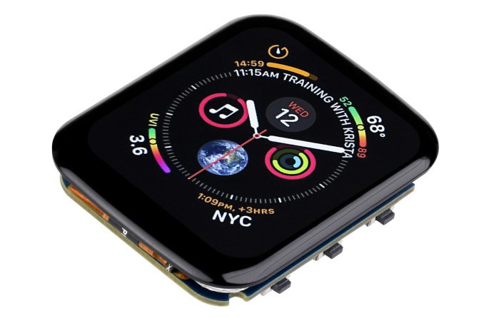
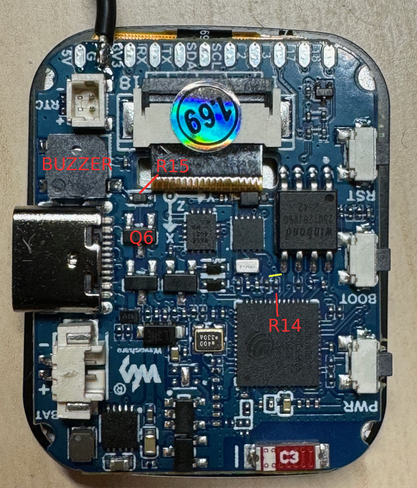

# BSP: Waveshare ESP32-S3 Touch LCD 1.69



## Overview

This is a BSP for the Waveshare ESP32-S3 Touch LCD 1.69. It provides support for the LCD display and touch functionality, and offers guidance around the GPIO33 Buzzer / PSRAM conflict issue.

## Board Features

- ESP S3 with 8MB PSRAM (octo-spi) and 16MB Flash
- display controller is the ST7789 via 1b SPI
- capacitive touch (CST816D) via I2C
- hires small screen (240 x 280)
- onboard antenna
- spare GPIO (for SPI, UART, and I2C)
- GPIO(1) has battery voltage divider
- PCF85064 RTC
- QMI8658 IMU
- 11 on-board test points for external connection.

## BSP

The BSP is an adaptation of `esp_bsp_generic` and provides LCD and Touch screen support.

## LCD Display

1. Enable display in `menuconfig`
    - `BSP_DISPLAY_ENABLED`

2. Set right rotation of the screen in `menuconfig`
    - `BSP_DISPLAY_ROTATION_SWAP_XY`
    - `BSP_DISPLAY_ROTATION_MIRROR_X`
    - `BSP_DISPLAY_ROTATION_MIRROR_Y`

3. Set other display params in `menuconfig`
    - `BSP_DISPLAY_PIXEL_CLOCK`
    - `BSP_DISPLAY_BRIGHTNESS_LEDC_CH`
    - `BSP_LCD_DRAW_BUF_HEIGHT`
    - `BSP_LCD_DRAW_BUF_DOUBLE`

## LCD Touch

1. Enable display touch in `menuconfig`
    - `BSP_TOUCH_ENABLED`

2. Set right rotation of the screen in `menuconfig`
    - `BSP_TOUCH_ROTATION_SWAP_XY`
    - `BSP_TOUCH_ROTATION_MIRROR_X`
    - `BSP_TOUCH_ROTATION_MIRROR_Y`

Example code:
```
    /* Initialize display, touch and LVGL */
    bsp_display_start();

    /* Set display brightness to 100% */
    bsp_display_backlight_on();

    bsp_display_lock(0);
    /* === Your LVGL code here === */
    bsp_display_unlock();
```

# PSRAM / Buzzer Conflict

The large PSRAM (octal IO) conflicts with the buzzer on GPIO33.  If you need to use the buzzer, don't enable PSRAM, and make sure GPIO33 is LOW. If PSRAM is more valuable, then you need to disable the buzzer, and leave the GPIO33 line alone.

If you use the PSRAM without disabling the buzzer, you will hear strange noises and the power supply may get warm.  If you don't use the PSRAM and don't set the buzzer line to low, the power supply may get hot.  Do one thing or the other.



The buzzer is driven by transistor Q6, controlled by GPIO33 via a resistor R14.  To disable the buzzer, either cut the trace that connects GPIO33 to the transistor or remove the resistor R14. 

Suggested cut line indicated in yellow above.

With this trace cut, then do not interfere with GPIO33.  The PSRAM code will handle it.

If you want to use the buzzer, or haven't cut the R14 trace, make sure GPIO33 is LOW.

```
    /* Initialize buzzer, leaves the line low */
    bsp_buzzer_init();
```

If you need to control the buzzer line

```
    /* Control the buzzer line */
    bsp_buzzer_control( 1 );
    bsp_buzzer_control( 0 );
```

# ToDo

- Add support for the RTC
- Add support for the IMU

# Resources

## WaveShare

Product page - https://www.waveshare.com/esp32-s3-touch-lcd-1.69.htm

Wiki - https://www.waveshare.com/wiki/ESP32-S3-Touch-LCD-1.69

<!-- Autogenerated start: Dependencies -->
<!-- Autogenerated end: Dependencies -->
