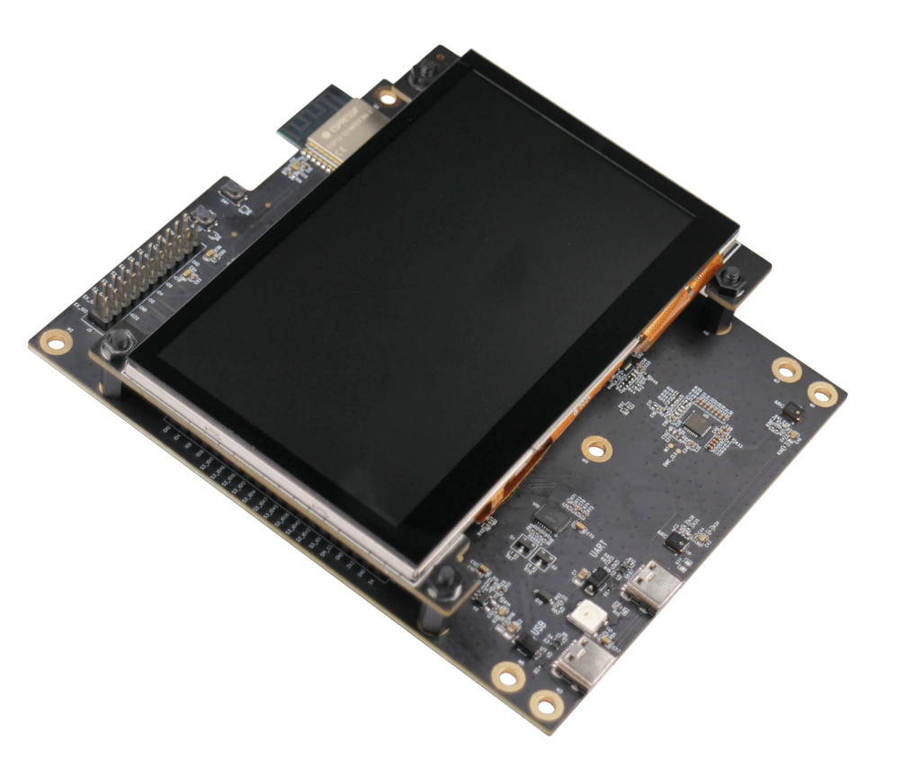

# LCD screen and touch controllers list

The list of available LCD displays and links to LCD driver component and touch driver component.

|    Picture                               | Name | LCD Controller | LCD Driver | Touch Controller | Touch Driver | Notes |
| ---------------------------------------- | ---- | -------------- | ---------- | ---------------- | ------------ | ----- |
|  | [ESP-WROVER-KIT](https://docs.espressif.com/projects/esp-idf/en/latest/esp32/hw-reference/esp32/get-started-wrover-kit.html) | ST7789  | [IDF](https://github.com/espressif/esp-idf/tree/master/components/esp_lcd) | - | - | |
|  | [ESP-WROVER-KIT](https://docs.espressif.com/projects/esp-idf/en/latest/esp32/hw-reference/esp32/get-started-wrover-kit.html) | ILI9341 | [IDF](https://github.com/espressif/esp-idf/tree/master/components/esp_lcd) | -| - | |
|  | ESP-BOX | ST7789 | [IDF](https://github.com/espressif/esp-idf/tree/master/components/esp_lcd) | TT21100 | [Component Manager](https://components.espressif.com/component/espressif/esp_lcd_touch_tt21100) | |
|  | [ESP32-S2-Kaluga Kit](https://docs.espressif.com/projects/esp-idf/en/latest/esp32s2/hw-reference/esp32s2/user-guide-esp32-s2-kaluga-1-kit.html) | ST7789  | [IDF](https://github.com/espressif/esp-idf/tree/master/components/esp_lcd) | - | - | |
|  | [ESP32-S3-USB-OTG](https://docs.espressif.com/projects/esp-dev-kits/en/latest/esp32s3/esp32-s3-usb-otg/user_guide.html) | ST7789  | [IDF](https://github.com/espressif/esp-idf/tree/master/components/esp_lcd) | - | - | |
|  | [ESP32-S2-HMI-DevKit-1](https://docs.espressif.com/projects/esp-dev-kits/en/latest/esp32s2/esp32-s2-hmi-devkit-1/user_guide.html#hardware-overview) | RM68120 | **IN PLAN** | FT5X06 | [Component Manager](https://components.espressif.com/component/espressif/esp_lcd_touch_ft5x06) | |
|  | [Waveshare 1.28" round LCD](https://www.waveshare.com/product/1.28inch-lcd-module.htm) | GC9A01 | [Component Manager](https://components.espressif.com/component/espressif/esp_lcd_gc9a01) | - | - | |
|  | [Waveshare 7" LCD](https://www.waveshare.com/7inch-capacitive-touch-lcd-c.htm) | RA8875 | [Component Manager](https://components.espressif.com/component/espressif/esp_lcd_ra8875) | GT911 | [Component Manager](https://components.espressif.com/component/espressif/esp_lcd_touch_gt911) | |
|  | [Adafruit PiTFT - 2.8"](https://learn.adafruit.com/adafruit-pitft-28-inch-resistive-touchscreen-display-raspberry-pi) | ILI9341 | [Component Manager](https://components.espressif.com/component/espressif/esp_lcd_ili9341) | STMPE610 | [Component Manager](https://components.espressif.com/component/espressif/esp_lcd_touch_stmpe610) | |
|  | Parallel 320x480 4" | ILI9488 | [Component Manager](https://components.espressif.com/components/atanisoft/esp_lcd_ili9488) | - | - | Also working with SPI communication interface |
|  | [64×128 1.3" OLED](https://www.waveshare.com/1.3inch-oled-module-c.htm) | SH1107 | [Component Manager](https://components.espressif.com/component/espressif/esp_lcd_sh1107) | - | - | |
|  | 128x32 0,91" OLED | SSD1306 | [IDF](https://github.com/espressif/esp-idf/tree/master/components/esp_lcd) | - | - | |
|  | Parallel | SSD1963 | **N/A** | - | - | |
|  | Parallel/SPI | ST7796 | [Component Manager](https://components.espressif.com/component/espressif/esp_lcd_st7796) | - | - | |
|  | Parallel | NT35510 | [Component Manager](https://components.espressif.com/component/espressif/esp_lcd_nt35510) | - | - | |
|  | [ESP32-S3-LCD-EV-Board](https://docs.espressif.com/projects/esp-dev-kits/en/latest/esp32s3/esp32-s3-lcd-ev-board/user_guide.html) | GC9503 | [Component Manager](https://components.espressif.com/component/espressif/esp_lcd_gc9503) | FT5X06 | [Component Manager](https://components.espressif.com/component/espressif/esp_lcd_touch_ft5x06) | |
|  | [ESP32-S3-LCD-EV-Board-2](https://docs.espressif.com/projects/esp-dev-kits/en/latest/esp32s3/esp32-s3-lcd-ev-board/user_guide.html) | ST7262E43 | **N/A** | GT1151 | [Component Manager](https://components.espressif.com/component/espressif/esp_lcd_touch_gt1151) | |
|  | HDMI | LT8912B | [Component Manager](https://components.espressif.com/component/espressif/esp_lcd_lt8912b) | - | - | |
