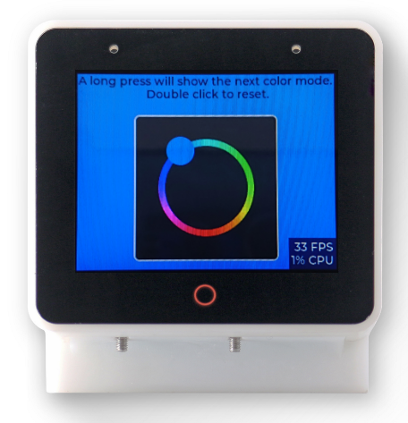

| Supported Targets | ESP-BOX (ESP32-S3) |
| ----------------- | ------------------ |

# ESP-BOX Touch Screen Color Wheel Example

This example demonstrates usage of ESP-BOX Board Support Package. This is a single purpose example, which is focused on display + touch applications: user can change background color by selecting it on a color wheel on the touch screen. 

|  Main screen  |
| :----------: |
|  |

## How to use the example

### Hardware Required

* ESP-BOX
* USB-C Cable

### Compile and flash

```
idf.py -p COMx flash monitor
```

### Example outputs

After initialization:
```
...
I (323) cpu_start: Starting scheduler on PRO CPU.
I (0) cpu_start: Starting scheduler on APP CPU.
I (345) gpio: GPIO[4]| InputEn: 0| OutputEn: 1| OpenDrain: 0| Pullup: 0| Pulldown: 0| Intr:0
I (345) gpio: GPIO[48]| InputEn: 0| OutputEn: 1| OpenDrain: 0| Pullup: 0| Pulldown: 0| Intr:0
I (475) ESP-BOX: Starting LVGL task
I (475) ESP-BOX: Setting LCD backlight: 50%
I (515) ESP-BOX: Example initialization done.
```

When selected color:
```
I (3675) ESP-BOX: Selected color in RGB565: 0xdf49
```
